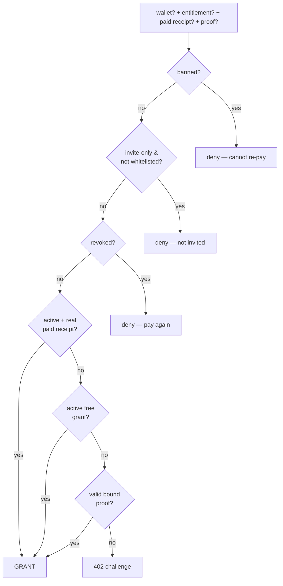

import { Callout, Cards } from 'nextra/components'

# Whitelists & access control

Nibgate lets creators gate content beyond "free vs paid": whitelisted wallet lists, supporter price tiers, and invite-only posts. This page is the contract behind those controls — one rule that runs identically on Nibshare and Subblogs.

## The three policy knobs

Every gated resource (a Nibshare share or a Subblog post) has three policy fields. The exact same shape is used on both rails:

| Field | Meaning |
|---|---|
| `price` | Public price in USDC. `0` / empty = free for everyone. |
| `whitelist` | Array of wallet addresses. Empty = "open to anyone who pays". |
| `whitelistPrice` | Price whitelisted wallets pay. `null` = same as public, `0` = free tier. |
| `publicAccess` | `true` = anyone may unlock. `false` = **invite-only**: nobody outside the whitelist can even attempt a payment. |

```ts
// The policy object both backends feed into the access rule.
{
  price: '0.50',        // public price (USDC, decimal string)
  whitelist: ['0xabc…'], // supporter wallets
  whitelistPrice: '0',   // whitelisted wallets read free
  publicAccess: true,    // true = public + whitelist tier; false = invite-only
}
```

The whitelist doubles as both a **price tier** and an **invite list**:

- With `publicAccess: true`, the whitelist is just pricing — a listed wallet gets `whitelistPrice`, everyone else pays `price`.
- With `publicAccess: false`, the whitelist is the door — unlisted wallets get `403` before any payment is possible.

## Who may read: the access decision

Every gate (page render, media proxy, document, agent) evaluates one centralized rule — `canAccess` from `@nibgate/sdk/server` (`packages/nibgate/src/server/access-policy.js`). The hub and Subblogs both import it; there is exactly one rule.

The decision runs in this order:

1. **Ban** — entitlement `banned` ⇒ deny. Hard: cannot re-purchase.
2. **Revoke** — entitlement `revoked` ⇒ deny + prompt to pay again.
3. **Active paid** — entitlement `active` **and** backed by a real receipt ⇒ grant, regardless of proof age.
4. **Active free** — entitlement `active` from a free grant ⇒ grant (re-granted each visit).
5. **Proof fast-path** — an untampered, bound proof ⇒ grant + lazily reconcile the entitlement.
6. **Otherwise** ⇒ `402` + x402 payment challenge.

Rules 3–5 run **before** any proof-freshness check. This is the load-bearing fix: an expired proof (or cleared browser storage) never re-charges a wallet that already paid.



### Wallet resolution priority

The rule needs to know who is asking. Resolution order: explicit `?wallet=` → SIWE session → payment-proof payer → `undefined` (anonymous charge path). Media proxies send `?wallet=` automatically via the wallet SDK's `accessPathFor()` helper, so an `` or `<audio>` tag can authenticate even though it cannot carry headers.

## Entitlements are the source of truth

A **proof is a convenience, never the authority.** Three records back every grant:

| Record | Role |
|---|---|
| `Receipt` | Immutable proof of a **paid** purchase (`amount > 0`). Free grants have none. |
| `Entitlement` | *Current* access state for `(resourceId, wallet)` — `active` / `revoked` / `banned`. This is what the rule reads. |
| `Event` | Append-only audit log (`grant`, `revoke`, `restore`, `ban`, `invite_only_flip`, `refund_mark`, …). |

Key invariants:

```text
active + source='paid'  ⇔  a real receipt (amount > 0, not refunded) exists
revoked / banned        ⇒  not granted, regardless of any proof age
free grant              ⇒  NOT lifetime — re-granted each visit
```

So lifetime access survives proof expiry, storage clears, and restarts — the receipt + entitlement are in the database, and the server re-issues a fresh proof on every legit visit.

## Proofs (the cache layer)

- **Nibshare**: `{wallet}.{iat}.{exp}.{mac}` — HMAC binds `(shareId, wallet, iat, exp)`. 12h TTL, same as the SDK.
- **Subblogs**: SDK-signed token, 12h TTL.

The TTL only bounds replay surface; it never changes the access decision (rules 3–4 override an expired proof). A proof must be bound to `(resourceId, wallet)` — tampering with either breaks the signature.

```text
0xabc…A7F3.1782345678.1782387678.5x2fYv…   (wallet.iat.exp.mac)
```

## Payment idempotency: one grant per payment

x402 has no native payment id — the settlement `txHash` is the only stable identity. Both rails implement a **pre-grant claim** keyed on `(txHash, resourceId)` with a unique database index:

1. Before granting, look up `(paymentNonce=txHash, resourceId)`.
2. Already there? Return the **stored receipt** — no second grant, no double unlockCount, no double event.
3. Otherwise create the receipt + entitlement atomically.

A replayed proof is therefore safe by construction — it hits the same row and yields the same response, which is the #1 x402 production failure mode (248 grants per single payment measured on a live endpoint without this guard).

## Policy edits: the transition table

Creators can edit any policy field at any time, even after publish. The rule is deterministic and fair — existing acquirers keep the terms they were offered:

| Starting state | Admin action | Result for a prior *non-whitelisted* buyer | Refund? |
|---|---|---|---|
| paid, paid once | (nothing) | keeps forever (lifetime) | — |
| paid once at $X | price → $Y | keeps at $X (grandfathered) | — |
| whitelist free grant | whitelist removed | keeps until last grant's term; must pay on fresh visit | — |
| free grant exists | price set | served free till expiry, then `402` | — |
| paid → free | price removed | everyone granted free per visit | — |
| invite-only off → on | `publicAccess:false` | **denied** — paid and now cut off | **yes (auto)** |
| invite-only on → off | `publicAccess:true` | prior paid regain gate access | — |
| active paid | `revoke` | `403` "pay again"; may re-purchase | yes |
| active | `ban` | `403` everywhere; **cannot** re-purchase | yes (paid) |
| revoked | `restore` | back to active; refund-mark reversed | no |

### The invite-only flip (gap #11)

Flipping `publicAccess` to `false` is the one edit that would silently cut off people who paid. Both rails handle it automatically:

1. Compute the cut-off set: **active paid** entitlements whose wallet is **not** in the new whitelist.
2. Revoke each and mark its latest un-refunded paid receipt `refundedAt` (bookkeeping refund — exactly the `revoke` rule).
3. Return `cutOffWallets` in the response so the admin UI can surface the count.

<Callout type="warning">
The refund here is **bookkeeping**, not an on-chain return. x402 has no refund primitive; the actual USDC return is a separate manual step on the gateway/merchant side. The admin UI distinguishes "refunded (booked)" from "refunded (sent)".
</Callout>

## Revoke, ban, restore

| Action | Entitlement | Receipt | Wallet can re-purchase? |
|---|---|---|---|
| `revoke` | → `revoked` | refund-marked | **yes** (new receipt, new grant) |
| `ban` | → `banned` | refund-marked | **no** — hard deny, only `restore` reverses it |
| `restore` | → `active` | refund-mark reversed | — |

Revoke is **immediate and DB-backed** — there is no TTL window where a stale proof still works, because the ban/revoke check runs before any proof check. Every transition writes an `Event` with the actor and reason.

## Where the rule lives

The access rule is centralized in the SDK and imported by both backends — there is no drift between them:

| Surface | Rule |
|---|---|
| SDK | `packages/nibgate/src/server/access-policy.js` — `canAccess`, `effectivePrice`, `inWhitelist`, `paidCutoffWallets`, … |
| Nibshare | `backend/src/server/nibshare/{service,controller,utils}.js` (delegates to the SDK) |
| Subblogs | `subblogs/backend/src/services/access.service.js` + `routes/v1/nibgate.route.js` (delegates to the SDK) |

Both `NibShareReceipt` / `BlogPostReceipt` carry a unique `(paymentNonce, resourceId)` index and a `refundedAt`; both `NibShareEntitlement` / `BlogPostEntitlement` carry a `source` (`paid` | `free`).

## Related

- Payments rail: `/payments-receipts`
- Nibshare quick-share: `/nibshare`
- SDK source: `packages/nibgate/src/server/access-policy.js`
- Design + transition rationale: `ACCESS-CONTROL-DESIGN.md` (repo root)
