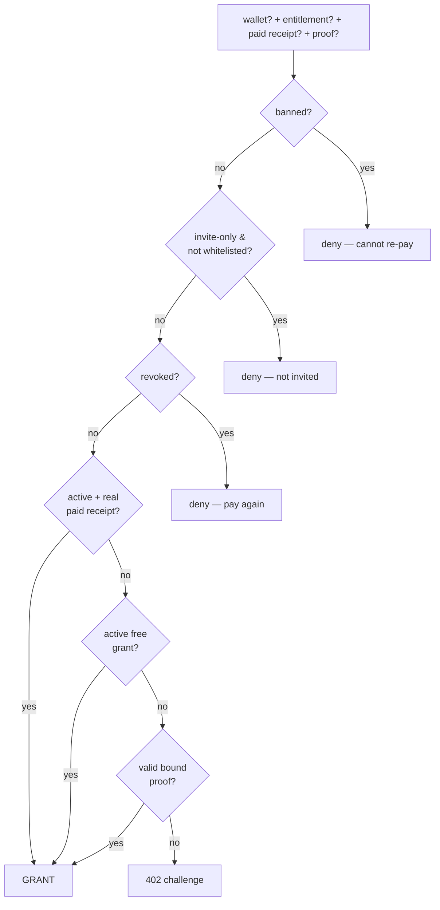

import { Callout, Cards } from 'nextra/components'

# Whitelists & access control

Nibgate lets creators gate content beyond "free vs paid": whitelisted wallet lists, supporter price tiers, and invite-only posts. This page is the contract behind those controls — one rule that runs identically on Nibshare and Subblogs.

## The three policy knobs

Every gated resource (a Nibshare share or a Subblog post) has three policy fields. The exact same shape is used on both rails:

| Field | Meaning |
|---|---|
| `price` | Public price in USDC. `0` / empty = free for everyone. |
| `whitelist` | Array of wallet addresses. Empty = "open to anyone who pays". |
| `whitelistPrice` | Price whitelisted wallets pay. `null` = same as public, `0` = free tier. |
| `publicAccess` | `true` = anyone may unlock. `false` = **invite-only**: nobody outside the whitelist can even attempt a payment. |

```ts
// The policy object both backends feed into the access rule.
{
  price: '0.50',        // public price (USDC, decimal string)
  whitelist: ['0xabc…'], // supporter wallets
  whitelistPrice: '0',   // whitelisted wallets read free
  publicAccess: true,    // true = public + whitelist tier; false = invite-only
}
```

The whitelist doubles as both a **price tier** and an **invite list**:

- With `publicAccess: true`, the whitelist is just pricing — a listed wallet gets `whitelistPrice`, everyone else pays `price`.
- With `publicAccess: false`, the whitelist is the door — unlisted wallets get `403` before any payment is possible.

## Who may read: the access decision

Every gate (page render, media proxy, document, agent) evaluates one rule — `canAccess` from `@nibgate/sdk/server` (`packages/nibgate/src/server/access-policy.js`). The hub (`nibshare/service.js` → `canAccessShare`) and Subblogs (`access.service.js` → `canAccessPost`) both wire it in as the authoritative decision at every gate — free/invite reads, paid unlocks, proof replay, lifetime re-issue, whitelist free tier, and media. Per-app code only assembles DB facts (entitlement, receipt, possession) and maps the result to HTTP; the rule itself lives in exactly one place.

The decision runs in this order:

1. **Ban** — entitlement `banned` ⇒ deny. Hard: cannot re-purchase.
2. **Revoke** — entitlement `revoked` ⇒ deny + prompt to pay again.
3. **Active paid** — entitlement `active` **and** backed by a real receipt ⇒ grant, regardless of proof age.
4. **Active free** — entitlement `active` from a free grant ⇒ grant (re-granted each visit).
5. **Proof fast-path** — an untampered, bound proof ⇒ grant + lazily reconcile the entitlement.
6. **Otherwise** ⇒ `402` + x402 payment challenge.

Rules 3–5 run **before** any proof-freshness check. This is the load-bearing fix: an expired proof (or cleared browser storage) never re-charges a wallet that already paid.



### Wallet resolution priority

The rule needs to know who is asking. Resolution order: explicit `?wallet=` → SIWE session **or** ownership-signature possession proof → payment-proof payer → `undefined` (anonymous charge path). Media proxies send `?wallet=` automatically via the wallet SDK's `accessPathFor()` helper, so an `` or `<audio>` tag can authenticate even though it cannot carry headers.

### Returning owners without a session (the ownership probe)

A returning owner can arrive with **no SIWE session and no cached proof** — a new device, a signed-out browser, an explicit disconnect. Entitlements remain the source of truth, so the flow must never charge them twice:

1. The client's access fetch already carries its *unverified* `?wallet=` claim. If receipts exist for that address, the 402 challenge body gains `ownedForClaim: true`. This is a cheap, untrusted hint — the claim alone grants nothing.
2. On seeing the flag, the SDK asks the wallet for **one** EIP-191 `personal_sign` over `ownershipMessage(resource, address)`:

   ```text
   Nibgate ownership confirmation
   resource:/writing/p2-paid
   wallet:0xabc…8c0d
   ```

   and retries the access check with header `x-nibgate-ownership-signature`.
3. The server recovers the signer (`verifyOwnershipSignature`). A match proves possession of the claimed key and the lifetime path re-issues a fresh proof **for free**. A wrong signer, tampered resource binding, or garbage signature fails closed to the ordinary payment challenge.

New buyers never see the extra prompt — the flag only appears when receipts already exist. Verified end-to-end: the probe returns 200 + fresh proof, creates no receipt, and moves nothing from gateway balance.

## Entitlements are the source of truth

A **proof is a convenience, never the authority.** Three records back every grant:

| Record | Role |
|---|---|
| `Receipt` | Immutable proof of a **paid** purchase (`amount > 0`). Free grants have none. |
| `Entitlement` | *Current* access state for `(resourceId, wallet)` — `active` / `revoked` / `banned`. This is what the rule reads. |
| `Event` | Append-only audit log (`view`, `unlock`, `revoke`, `ban`, `invite_only_flip`, `publish`). Note: no `restore` / `grant` / `price_change` event type exists in code. |

Key invariants:

```text
active + source='paid'  ⇔  a real receipt (amount > 0) exists
revoked / banned        ⇒  not granted, regardless of any proof age
free grant              ⇒  NOT lifetime — re-granted each visit
```

So lifetime access survives proof expiry, storage clears, and restarts — the receipt + entitlement are in the database, and the server re-issues a fresh proof on every legit visit.

## Proofs (the cache layer)

- **Nibshare**: `{wallet}.{iat}.{exp}.{mac}` — HMAC binds `(shareId, wallet, iat, exp)`. 12h TTL, same as the SDK.
- **Subblogs**: SDK-signed token, 12h TTL.

The TTL only bounds replay surface; it never changes the access decision (rules 3–4 override an expired proof). A proof must be bound to `(resourceId, wallet)` — tampering with either breaks the signature.

```text
0xabc…A7F3.1782345678.1782387678.5x2fYv…   (wallet.iat.exp.mac)
```

## Payment idempotency: one grant per payment

x402 has no native payment id — the settlement `txHash` is the only stable identity. Both rails implement a **pre-grant claim** keyed on `(txHash, resourceId)` with a unique database index:

1. Before granting, look up `(paymentNonce=txHash, resourceId)`.
2. Already there? Return the **stored receipt** — no second grant, no double unlockCount, no double event.
3. Otherwise create the receipt + entitlement atomically.

A replayed proof is therefore safe by construction — it hits the same row and yields the same response, which is the #1 x402 production failure mode (248 grants per single payment measured on a live endpoint without this guard).

## Policy edits: the transition table

Creators can edit any policy field at any time, even after publish. The rule is deterministic and fair — existing acquirers keep the terms they were offered:

<Callout type="info">
This table assumes a **non-expiring** resource. If the share/post has an `expiresAt`, the reachability gate returns `419` for **everyone** once it passes — including wallets with an active paid entitlement — because it runs before any entitlement check (verified live).
</Callout>

| Starting state | Admin action | Result for a prior *non-whitelisted* buyer |
|---|---|---|
| paid, paid once | (nothing) | keeps forever (lifetime) |
| paid once at $X | price → $Y | keeps at $X (grandfathered) |
| whitelist free grant | whitelist removed | keeps until last grant's term; must pay on fresh visit |
| free grant exists | price set | served free till expiry, then `402` |
| paid → free | price removed | everyone granted free per visit |
| invite-only off → on | `publicAccess:false` | **denied** — paid and now cut off (gap #11, no refund) |
| invite-only on → off | `publicAccess:true` | prior paid regain gate access |
| active paid | `revoke` | `403` "pay again"; may re-purchase |
| active | `ban` | `403` everywhere; **cannot** re-purchase |
| revoked | `restore` | back to active — but **no audit event** is written, and whitelist membership stripped by a prior `ban` is not re-added |
| banned, then restored | `restore` | entitlement active again; hub whitelist entry removed by `ban` stays removed |

### The invite-only flip (gap #11)

Flipping `publicAccess` to `false` is the one edit that would silently cut off people who paid. Both rails handle it automatically:

1. Compute the cut-off set: **active paid** entitlements whose wallet is **not** in the new whitelist.
2. Revoke each via the `revoke` rule.
3. Return `cutOffWallets` in the response so the admin UI can surface the count.

<Callout type="warning">
Revoking a payer **never refunds money**. Every x402 payment is an irreversible transfer straight to the creator's wallet — there is no escrow, no chargeback, and no refund primitive. Revoke/ban only flip access; if a creator wants to return funds, they send the transfer from their own wallet outside the platform.
</Callout>

## Revoke, ban, restore

Revoke/ban only change *access*, never money — x402 payments are irreversible one-shot transfers to the creator's wallet, so there is no refund to issue.

| Action | Entitlement | Wallet can re-purchase? |
|---|---|---|
| `revoke` | → `revoked` | **yes** (new receipt, new grant) |
| `ban` | → `banned` | **no** — hard deny, only `restore` reverses it |
| `restore` | → `active` | — |

On the hub, `ban` also strips the wallet from `whitelist[]` (so invite-only shares don't keep re-asserting it); subblogs does not. `restore` never re-adds the whitelist entry. <Callout type="warning">Note: `restore` does not write an audit `Event`, and no `grant`/`price_change`/`restore` event type exists in code.</Callout>

Revoke is **immediate and DB-backed** — there is no TTL window where a stale proof still works, because the ban/revoke check runs before any proof check. `revoke` and `ban` each write an `Event`; `restore` does not (and no `grant`/`price_change` event type exists).

## Where the rule lives

The access rule is centralized in the SDK and wired into both backends:

| Surface | Rule |
|---|---|
| SDK | `packages/nibgate/src/server/access-policy.js` — `canAccess`, `effectivePrice`, `inWhitelist`, `paidCutoffWallets`, … (unit-tested) |
| Nibshare | `backend/src/server/nibshare/{service,controller}.js` — `service.canAccessShare` assembles DB facts and calls the SDK rule at every gate |
| Subblogs | `subblogs/backend/src/services/access.service.js` + `routes/v1/nibgate.route.js` — `accessService.canAccessPost` does the same |

Per-app code is limited to fact assembly (entitlement, receipt, possession) and HTTP mapping; the rule logic is single-sourced. Two cross-rail divergences remain on the *write side*: hub `banEntitlement` strips the wallet from `whitelist[]`, subblogs does not; and `restore` writes no audit event on either rail.

Both `NibShareReceipt` / `BlogPostReceipt` carry a unique `(paymentNonce, resourceId)` index; both `NibShareEntitlement` / `BlogPostEntitlement` carry a `source` (`paid` | `free`).

## Related

- Payments rail: `/payments-receipts`
- Nibshare quick-share: `/nibshare`
- SDK source: `packages/nibgate/src/server/access-policy.js`
- Design + transition rationale: `ACCESS-CONTROL-DESIGN.md` (repo root)
