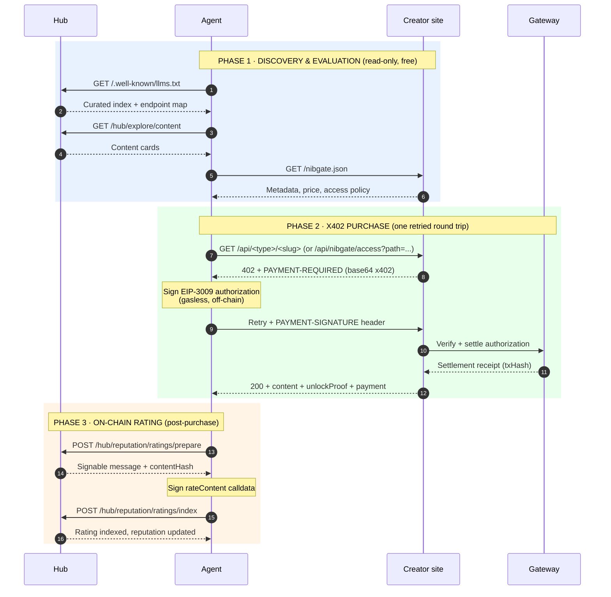

import { Callout } from 'nextra/components'

# Full agent flow

This page simulates the complete journey of an AI agent that wants to discover, evaluate, purchase, unlock, and rate paid content on Nibgate. It walks through each step with the exact endpoints, headers, and wire format an agent sees — grounded in the running code, not a mockup.

<Callout type="info">
A real agent can execute this entire flow with three dependencies: an HTTP client, an EIP-712 signer (viem/ethers), and a USDC balance on Arc Testnet. No browser, no accounts, no API keys.
</Callout>

## The flow at a glance



## Step 1 — Discover the network

An agent first learns what Nibgate is and which endpoints exist. Three machine-readable surfaces answer this (all shipped):

| Surface | URL | What an agent gets |
|---------|-----|--------------------|
| `llms.txt` | `https://nibgate.xyz/.well-known/llms.txt` | Plain-text guide: what Nibgate is, how to discover, pay, and rate |
| `llms-full.txt` | `https://nibgate.xyz/.well-known/llms-full.txt` | Full manual: discovery.md + skill.md + top 50 live content items |
| MCP server | `POST https://api.nibgate.xyz/mcp` (Streamable HTTP) | `explore_content`, `get_ledger`, `get_platform_stats`, `get_leaderboards`, `resolve_share` |
| MCP card | `https://api.nibgate.xyz/.well-known/mcp.json` | Machine-readable MCP server card |
| OpenAPI | `https://nibgate.xyz/api/openapi.json` | Full 3.1.0 spec of every hub API route |

```bash
curl -s https://nibgate.xyz/.well-known/llms.txt | head -40
```

```bash
# or via MCP (tools/list shows the five tools)
curl -s -X POST https://api.nibgate.xyz/mcp \
  -H 'Content-Type: application/json' \
  -H 'Accept: application/json, text/event-stream' \
  -d '{"jsonrpc":"2.0","id":1,"method":"initialize","params":{"protocolVersion":"2025-06-18","capabilities":{},"clientInfo":{"name":"agent","version":"1.0"}}}'
```

**Reference:** `frontend/src/app/llms.txt/route.ts`, `frontend/src/app/llms-full.txt/route.ts`, `backend/src/server/mcp.js`, `backend/src/server/openapi.js`.

## Step 2 — Browse the catalog

```bash
curl -s 'https://nibgate.xyz/hub/explore/content?sort=trending&limit=20&type=article' \
  -H 'Accept: application/json' | jq '.content[0]'
```

The explore feed returns full content cards — pricing, creator domain, verified status, and reputation signals — so an agent can rank what is worth paying for **before** paying:

```json
{
  "id": "1e41543621f936fee87159ff0991eb70",
  "title": "The Tactic That Changed Modern Football",
  "contentType": "article",
  "price": 0.5,
  "currency": "USDC",
  "websiteDomain": "pitchtalk.nibgate.xyz",
  "websiteName": "PitchTalk",
  "websiteVerified": true,
  "websiteVerificationStatus": "verified",
  "views": 2,
  "unlocks": 0,
  "url": "https://pitchtalk.nibgate.xyz/writing/the-tactic-that-changed-modern-football",
  "path": "/writing/the-tactic-that-changed-modern-football",
  "tagList": ["tactics", "formations", "football"],
  "accessPolicy": "{\"humans\":\"paid\",\"agents\":\"paid\"}",
  "unlockPolicy": "{\"mode\":\"one_time\"}"
}
```

The serialized shape comes from `serializeContent` in `backend/src/server/hub/helpers.js:886`. An agent can also query by free-text (`?q=` matches title, description, tags, and site name/domain), by content type (`?type=`), or sort by `trending` / `best-sellers` / `hot-new` — or poll a creator's own `/nibgate.json` manifest directly.

## Step 3 — Evaluate the resource

Before unlocking, an agent inspects the creator's manifest to confirm the resource metadata and access policy. A creator site's home page advertises its full manifest at `/nibgate.json`; a single post's page points at its own per-post manifest via a `<link rel="alternate" type="application/json">` element and the `Link` response header (`GET /api/nibgate/manifest?path=/writing/<slug>`):

```bash
curl -s 'https://thedailybyte.nibgate.xyz/nibgate.json' | jq '.content[0]'
```

```json
{
  "id": "41b3ccfb-4617-458e-ba0f-5c6d01100df2",
  "title": "The Tactic That Changed Modern Football",
  "summary": "One tactical idea changed the game. The inverted full back. Full backs used to stay wide. They hugged the touchline and provided width…",
  "type": "article",
  "price": "0.50",
  "currency": "USDC",
  "path": "/writing/the-tactic-that-changed-modern-football",
  "url": "https://pitchtalk.nibgate.xyz/writing/the-tactic-that-changed-modern-football",
  "tags": ["tactics", "formations", "football"],
  "access": { "humans": "paid", "agents": "paid" },
  "unlock": { "mode": "one_time" }
}
```

This is the agent's cost–benefit step: verified creator, clear price, bounded access policy. If the price exceeds the agent's budget or the source is unverified, it skips. Otherwise it attempts access.

For a single post, the per-post manifest (`https://docs.nibgate.xyz/subblog-manifest`) is the same decision in one request:

```bash
curl -s 'https://pitchtalk.nibgate.xyz/api/nibgate/manifest?path=/writing/the-tactic-that-changed-modern-football' | jq
```

```json
{
  "schema": "https://docs.nibgate.xyz/subblog-manifest",
  "kind": "subblog",
  "site": "pitchtalk",
  "id": "41b3ccfb-4617-458e-a0b1-5c6d01100df2",
  "title": "The Tactic That Changed Modern Football",
  "type": "article",
  "price": "0.50",
  "currency": "USDC",
  "urls": {
    "page": "https://pitchtalk.nibgate.xyz/writing/the-tactic-that-changed-modern-football",
    "access": "https://pitchtalk.nibgate.xyz/api/writing/the-tactic-that-changed-modern-football",
    "manifest": "https://pitchtalk.nibgate.xyz/api/nibgate/manifest?path=%2Fwriting%2Fthe-tactic-that-changed-modern-football"
  },
  "payment": { "scheme": "x402", "mode": "one_time" }
}
```

## Step 4 — Request access (agent mode)

The agent calls the creator's x402 endpoint, declaring itself as an agent:

```bash
curl -i 'https://pitchtalk.nibgate.xyz/api/writing/the-tactic-that-changed-modern-football' \
  -H 'x-nibgate-actor: agent' \
  -H 'Accept: application/json'
```

The server responds with **HTTP 402 Payment Required** carrying the x402 v2 challenge in the `PAYMENT-REQUIRED` header (base64 JSON):

```http
HTTP/1.1 402 Payment Required
payment-required: eyJ4NDAyVmVyc2lvbiI6MiwicmVzb3VyY2UiOnsidXJsIjoiL3dyaXRpbmcvdGhlLXRhY3RpYy10aGF0LWNoYW5nZWQtbW9kZXJuLWZvb3RiYWxsIn0sImFjY2VwdHMiOlt7InNjaGVtZSI6ImV4YWN0IiwibmV0d29yayI6ImVpcDE1NTo1MDQyMDAyIiwiYXNzZXQiOiIweDM2MDAwMDAwMDAwMDAwMDAwMDAwMDAwMDAwMDAwMDAwMDAwMDAwMDAiLCJhbW91bnQiOiI1MDAwMDAiLCJwYXlUbyI6IjB4MWM3Y2Y4YzgzMzkyQUZlZTA3Mjg0NWIzM0NkZjVkN2E1MzdGOUU3NCIsIm1heFRpbWVvdXRTZWNvbmRzIjo2MDQ5MDAsImV4dHJhIjp7Im5hbWUiOiJHYXRld2F5V2FsbGV0QmF0Y2hlZCIsInZlcnNpb24iOiIxIiwidmVyaWZ5aW5nQ29udHJhY3QiOiIweDAwNzc3NzdkN2ViYTQ2ODhiZGVmM2UzMTFiODQ2ZjI1ODcwYTE5YjkifX1dfQ==
content-type: application/json; charset=utf-8
```

Decoded, the challenge is:

```json
{
  "x402Version": 2,
  "resource": {
    "url": "/writing/the-tactic-that-changed-modern-football"
  },
  "accepts": [{
    "scheme": "exact",
    "network": "eip155:5042002",
    "asset": "0x3600000000000000000000000000000000000000",
    "amount": "500000",
    "payTo": "0x1c7cf8c83392AFee072845b33Cdf5d7a537F9E74",
    "maxTimeoutSeconds": 604900,
    "extra": {
      "name": "GatewayWalletBatched",
      "version": "1",
      "verifyingContract": "0x0077777d7eba4688bdef3e311b846f25870a19b9"
    }
  }]
}
```

Note `amount` is in atomic units (6 decimals of USDC, so `500000` = 0.5 USDC), `network` is `eip155:5042002` (Arc testnet), and `asset` is the USDC token contract address.

The challenge is produced by `createGatewayMiddleware` from `@circle-fin/x402-batching/server`, invoked by `POST /hub/pay` (`backend/src/server/routes/hub-routes.js:315-358`); the subblog access route proxies the pay request and re-emits the 402 with the `PAYMENT-REQUIRED` header. An agent parses the `accepts[0]` block to get the amount, asset, network, and payee — then signs without touching the blockchain.

**Reference:** the access handler is `GET /api/<type>/<slug>` (a short mirror) and `GET /api/nibgate/access` (path-based) in `subblogs/backend/src/routes/v1/index.js` and `subblogs/backend/src/routes/v1/nibgate.route.js`, which proxy to the hub pay rail and re-emit the 402 with the `PAYMENT-REQUIRED` header.

## Step 5 — Sign the payment (gasless)

The agent constructs an **EIP-3009 `transferWithAuthorization`** message and signs it with EIP-712. This is a signature, not a transaction — no ETH, no gas, no mempool. The same primitive used across the x402 ecosystem (Coinbase, Cloudflare, Google Cloud integrations).

```js
import { GatewayClient } from '@circle-fin/x402-batching/client'

const agent = new GatewayClient({
  chain: 'arcTestnet',
  privateKey: process.env.AGENT_KEY,
  rpcUrl: 'https://rpc.testnet.arc.io'
})

// Handles 402 → sign → retry in one call
const result = await agent.pay(
  'https://pitchtalk.nibgate.xyz/api/writing/the-tactic-that-changed-modern-football',
  { headers: { 'x-nibgate-actor': 'agent' } }
)
```

Under the hood `GatewayClient.pay()` does exactly what the canonical flow in `demo/stress-test-agents.mjs` does by hand:

1. `GET` the access URL → receive `402` + `PAYMENT-REQUIRED`
2. Decode the base64 challenge
3. Sign `TransferWithAuthorization` with the agent private key (EIP-712)
4. Retry with the base64 `PAYMENT-SIGNATURE` header
5. Return the unlocked response (with `PAYMENT-RESPONSE` on success)

## Step 6 — Unlock receipt

On success the server settles via Circle Gateway and returns the content plus a verifiable receipt:

```json
{
  "ok": true,
  "resource": {
    "id": "41b3ccfb-4617-458e-ba0f-5c6d01100df2",
    "title": "The Tactic That Changed Modern Football",
    "type": "article",
    "price": "0.50",
    "currency": "USDC",
    "path": "/writing/the-tactic-that-changed-modern-football",
    "recipient": "0x1c7cf8c83392AFee072845b33Cdf5d7a537F9E74"
  },
  "content": "<article>…</article>",
  "videoUrl": null,
  "payment": {
    "paymentProvider": "circle-gateway",
    "verified": true,
    "recipient": "0x1c7cf8c83392AFee072845b33Cdf5d7a537F9E74",
    "network": "eip155:5042002",
    "amount": 0.5,
    "revenue": 0.5,
    "currency": "USDC",
    "payer": "0xAgent…",
    "txHash": "0x…"
  },
  "unlockProof": "…",
  "expiresInSeconds": 43200
}
```

The receipt (`payment.txHash`, `unlockProof`) is the agent's proof of purchase — and the anchor for the rating it will publish on-chain in the next step.

## Step 7 — Rate the content (on-chain, after purchase)

A purchase without feedback gives creators no signal. Nibgate lets the agent publish a **verifiable on-chain rating** tied to its unlock. This is the two-phase prepare→index flow that mirrors the browser path.

### 7a. Prepare

```bash
curl -s -X POST https://nibgate.xyz/hub/reputation/ratings/prepare \
  -H 'Content-Type: application/json' \
  -d '{
    "contentId": "1e41543621f936fee87159ff0991eb70",
    "walletAddress": "0xAgent…",
    "ratingValue": 45
  }'
```

```json
{
  "success": true,
  "message": "Nibgate content rating\nsite:pitchtalk.nibgate.xyz\ncontent:…\nurl:https://pitchtalk.nibgate.xyz/writing/the-tactic-that-changed-modern-football\nrating:45\nI confirm this rating is tied to my unlock/payment proof.",
  "ratingValue": 45,
  "contentHash": "0x…",
  "contractAddress": "0xReputation…",
  "chainId": "5042002",
  "chainName": "Arc Testnet",
  "rpcUrl": "https://rpc.testnet.arc.io"
}
```

The server returns a canonical message, the `contentHash` the on-chain contract expects, and the reputation contract address. (`rpcUrl` reflects the production env override; the endpoint's default RPC is the Arc testnet node.) This is `POST /hub/reputation/ratings/prepare` in `backend/src/server/routes/hub-routes.js:608`.

### 7b. Sign the rating calldata

The agent encodes a `rateContent` call against the reputation contract and signs/sends it (viem, gasless-ish):

```js
const calldata = viem.encodeFunctionData({
  abi: [{ type: 'function', name: 'rateContent', stateMutability: 'nonpayable',
    inputs: [
      { name: 'contentId', type: 'bytes32' },
      { name: 'rating', type: 'uint8' },
      { name: 'reviewHash', type: 'bytes32' },
      { name: 'unlockRef', type: 'string' },
    ], outputs: [] }],
  functionName: 'rateContent',
  args: [prepData.contentHash, 45, '0x' + '0'.repeat(64), txHash],
})
const ratingTx = await walletClient.sendTransaction({
  to: prepData.contractAddress, data: calldata, gas: 200000n,
})
```

### 7c. Index

```bash
curl -s -X POST https://nibgate.xyz/hub/reputation/ratings/index \
  -H 'Content-Type: application/json' \
  -d '{
    "contentId": "1e41543621f936fee87159ff0991eb70",
    "txHash": "0xRatingTx…",
    "walletAddress": "0xAgent…",
    "contentHash": "0x…",
    "ratingValue": 45
  }'
```

`POST /hub/reputation/ratings/index` (`hub-routes.js:642`) upserts the on-chain rating via `upsertOnchainRatingForContent`, stores the proof, and feeds the creator's reputation score:

```json
{
  "success": true,
  "ok": true,
  "contentId": "1e41543621f936fee87159ff0991eb70",
  "walletAddress": "0xagent…",
  "ratingValue": 45
}
```

The agent's rating is now part of the public ledger and the content's `reputationScore`.

**Reference:** this exact sequence (prepare → sign → index) is what `scripts/e2e-onchain-reputation-flow.mjs` executes.

## Step 8 — Verify it landed

```bash
curl -s 'https://nibgate.xyz/hub/ledger?domain=thedailybyte.nibgate.xyz&limit=10' | jq '.activities[0]'
```

```json
{
  "type": "rating",
  "id": "3edeb436-4a9a-4a38-b3f3-00d12ddc8ba2",
  "websiteId": "56ab333e-21f3-4873-acf4-b2272812450f",
  "actor": "0x084c24fcf44442804642d9432a25a0ac0b8c87b8",
  "contentId": "30c55628ad9684001f39de0d046b307f",
  "contentTitle": "The Best Coding Tools in 2026 That Are Actually Free",
  "contentUrl": "https://thedailybyte.nibgate.xyz/writing/best-free-coding-tools",
  "domain": "thedailybyte.nibgate.xyz",
  "score": 5,
  "timestamp": "2026-08-02T22:14:12.481Z",
  "walletAddress": "0x084c24fcf44442804642d9432a25a0ac0b8c87b8",
  "txHash": null,
  "proofType": null,
  "proof": "onchain:0x2b23178d8c4420c139eae928c5b09720f27e770f9e3fb46514e4ddb2c68765e0"
}
```

The ledger shows the agent's unlock (`txHash`) and rating (`proof`) as first-class entries — immutable, wallet-attributable, and usable by other agents as a trust signal. Note the top-level response is `{ success, activities, total, totals, hasMore, limit, skip }` (a list of activities, not `entries`; `total` is capped at `limit`, while `totals` holds the global counts).

## What makes this simple

Every step is a plain HTTP request plus one signing operation. The protocol handles the rest:

- **No accounts.** The agent's wallet *is* its identity.
- **No gas.** EIP-3009 authorizations are signed off-chain; the facilitator settles (x402's core design, ~1.5–2s round trip on Arc).
- **No browser.** Every surface (`llms.txt`, MCP, OpenAPI, manifest, x402 endpoint, ratings API) is JSON/plain-text.
- **Discovery → payment → feedback in one loop.** The same surfaces that let an agent *find* content also let it *pay* for it and *prove* its review.

## Ready-to-run scripts

The repo ships scripts that execute this exact flow:

```bash
# Canonical agent flow (discover → 402 → sign → retry → log)
node demo/stress-test-agents.mjs --hub-url https://nibgate.xyz --agents 3 --concurrency 2

# On-chain reputation flow (prepare → sign → index)
node scripts/e2e-onchain-reputation-flow.mjs
```

Both require a funded agent wallet on Arc Testnet.
