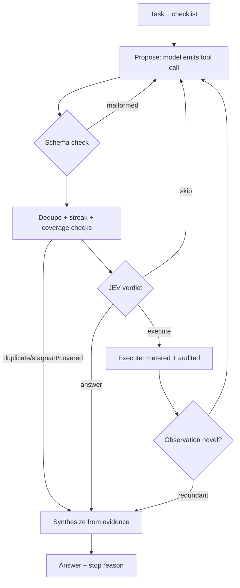

import { Callout } from 'nextra/components'

# Agent loop

How Dr. Nib's research agent decides what to do next — and, more importantly, how it decides to stop. The model proposes, a calibrated decisions model (JEV) disposes, tools execute. Termination is enforced in code with explicit bounds, never requested in prompt prose.

**Reference:** `dr-nib/backend/src/agent/loop.js`, `stops.js`, `self.js`, `limits.js`.

## One turn, precisely

1. **Budgets first.** Deadline, spend cap, and token budget are checked *before* any call — checking after the fact is how you overspend at the limit.
2. **Self-model.** Every turn injects a fresh snapshot: identity, network, exactly which tools are wired right now, chain RPC + USDC address, wallet balance, run budget left, steps left. Reasoning from a stale snapshot is how agents promise spends they cannot make.
3. **Checklist focus.** One LLM call per run extracts up to 5 bare measurable facts the task needs ("base fee gwei", not "current testnet fee"). Each turn aims at the first uncovered item, so multi-part tasks get one immediate ask instead of overwhelm.
4. **Propose.** The model returns one tool call, up to 3 independent free calls as a batch, `submit_answer` with a validated final answer, or `done`. Malformed JSON gets one minimal-context retry, then counts as a failed step — two in a row stops the run.
5. **Schema + duplicate gates.** Unknown tools and missing inputs die free with actionable feedback. Only *successful* executions poison the fingerprint (canonical key order, so reordered args can't dodge it); failures stay retryable.
6. **Judge.** Free reads run on a deterministic policy row. Anything moving money always goes to JEV with cost, history, and still-missing items in view. The verdict staples the canonical call fingerprint and is re-checked immediately before execution — a payload change after approval voids it.
7. **Execute.** Metered, audited (`tool.call` events carry cost + result summary), throws become failed steps rather than dead runs.
8. **Learn.** Successes feed coverage and novelty checks; failures shape the next proposal's history. Every 3rd step re-plans from the trajectory so far.

## Stop reasons

The run returns the *first* triggering condition — thresholds tune from this field, not vibes:

| Stop | Meaning |
|---|---|
| `done-signal` / `finish-tool` | model finished / validated answer accepted |
| `judge-answered` | JEV ruled history sufficient |
| `evidence-covered` | every checklist item matched in observations |
| `no-novelty` | consecutive near-identical observations |
| `streak-exhausted` | same tool succeeding over and over |
| `executed-duplicate` | identical successful call proposed again |
| `skip-loop` | identical proposal skipped repeatedly |
| `failure-budget` | 3 consecutive tool failures |
| `proposal-lost` | model can't produce valid JSON |
| `llm-unreachable` / `judge-unreachable` | provider/judge silent — stops instead of running blind |
| `max-steps` / `deadline` / `cost-budget` / `token-budget` | hard envelopes |
| `verdict-void` | payload changed after approval |

## Budgets (defaults)

| Envelope | Default | Source |
|---|---|---|
| Max steps | 6 | harness default (research loops run deeper than support bots) |
| Wall clock | 10 min | operational ceiling |
| Tool spend | $1 | sandbox + chain spend per task |
| LLM tokens | 120k in+out | production envelope |
| Failure budget | 3 consecutive | escalate, don't spiral |

All thresholds live named in one place with their provenance (`limits.js`) — standard-backed where a standard exists, labeled heuristic where tuned from traces.

## Memory, two levels

- **In-run:** shaped history (tool + literal input + outcome), coverage state, novelty window, re-plans.
- **Across runs:** failed trajectories distill one verbal lesson into an episodic store, injected into similar future tasks. Lessons are advisory — a run never dies because scaffolding did.

## Failure posture

Provider 403/429/5xx stop fast with the human fix named (not a JSON dump). Evaluator outage stops the run. Telemetry failures become failed steps. The finale guarantees a non-empty answer: model synthesis first, deterministic evidence extract as backstop.
