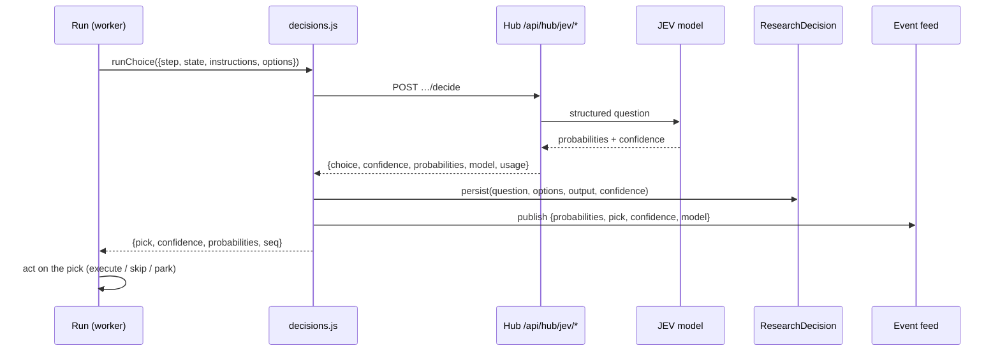

import { Callout } from 'nextra/components'

# How JEV decides

Every judgement in Dr. Nib — stop asking or probe deeper, run this tool or skip it, trust this source or not — is made by JEV, TypeSafe's decision model. The researching model never grades its own homework. This page is the technical account: what JEV is, the four primitives we call, the exact transport contract, where each decision sits in a run, and what happens when the seat is empty.

## Why a decisions model at all

Three properties make the split worth the extra hop, and each one is a failure mode of "just ask the model":

1. **Generative models are confidently wrong about their own uncertainty.** Ask one "are you sure?" in prose and it agrees with whatever you just asserted. JEV returns a number on a fixed scale, so a threshold means something and can be tuned.
2. **The model cannot shortcut its own stopping condition.** The LLM's only job is to produce the question *and its options*. "Should I stop?" becomes a choice among concrete alternatives with their costs stated — and the decision belongs to JEV. A stopping rule the model evaluates itself is a stopping rule the model will always satisfy.
3. **A number can be logged and audited.** "Stopped because JEV returned 0.08 on `brief_complete` with `proceed_now` at 0.79" is a defensible record. "The model decided it had enough" is not.

JEV is also cheap and fast: input tokens only (output is free), milliseconds beside an LLM round-trip, and no reasoning trace to leak or parse.

## A different kind of model

Chat models generate text. JEV generates nothing — it answers typed questions with calibrated probabilities. TypeSafe calls these *System One* models: structured decisions software can branch on directly, with no prose to parse and no hallucinated strings.

Calibration is the point: when JEV says 0.8, it is right about 80% of the time — like a weather forecast, not a vibe. **Confidence** is a separate value and means *concentration* (how torn it is between the options you gave it), not correctness. A confident wrong answer is possible, which is why thresholds are set from the cost of mistakes, never from round numbers.

## The four primitives we call

JEV's own vocabulary has three question shapes — **Choice**, **Noul** (does this hold?), and **Score** (where on an ordered scale?). We add a fourth shape at the transport layer: a **batch** of independent questions in one model round trip, so grading every candidate question or every claim costs a single call.

| Primitive | JEV question | Hub route | Client | Returns |
|---|---|---|---|---|
| Choice | which of these options? | `POST /api/hub/jev/decide` | `decide()` | `pick`, `confidence`, `probabilities` per option, `model`, `usage` |
| Noul | does this hold? | `POST /api/hub/jev/classify` | `classify()` | `probability` (0..1), `model`, `usage` |
| Score | where on this 2–6 level scale? | `POST /api/hub/jev/score` | `grade()` | probability-weighted `score`, per-level `probabilities`, `confidence` |
| Batch | answer many independent questions | `POST /api/hub/jev/batch` | `batch()` | `answers` keyed by question id, one `model`/`usage` |

**Reference:** `dr-nib/backend/src/jev/client.js` (transport), `decisions.js` (logging), `intake.js` (stop/reframe).

## The transport contract

Every primitive is one POST through the hub — the model key stays on the hub, which already rate-limits and sizes these calls. Dr. Nib never holds a provider key for judging.

```json
// POST /api/hub/jev/decide
{
  "state": "…the situation, clamped to 4000 chars…",
  "instructions": "…the criteria, clamped to 500 chars…",
  "candidates": [{ "id": "ask_more", "context": "…what this option means, 2000 chars…" }],
  "questionId": "intake_stop"
}
// -> { "success": true, "choice": "ask_more", "confidence": 0.71,
//      "probabilities": { "proceed": 0.21, "ask_more": 0.71, "reframe": 0.08 },
//      "model": "typesafe/jev-1.13", "usage": { … } }
```

`classify` and `score` take `{ state, instructions }` (plus `levels` for score); `batch` takes `{ state, questions: [{ id, type, instructions, options? }] }`. All inputs are clamped before they leave the process, so a runaway prompt can't blow the request.

A transport failure is **typed, not generic**: `JevUnavailable` (`client.js`) carries the HTTP status, and callers treat it as "stop and wait", never as "guess".

## How one decision actually happens



1. **Runtime builds the question.** State = the situation JEV reasons over. Candidates = the real trade-offs, including the honest one ("proceed and flag X as an assumption in the report") — JEV can only distribute probability across what it is shown.
2. **The hub relays it.** Dr. Nib holds no judging key; the hub owns the upstream and its own rate limits.
3. **JEV returns probabilities**, not prose. The pick is acted on; the confidence is recorded but not automatically honoured (see below).
4. **The decision is persisted** to `ResearchDecision` and published to the live feed in the same call — question, options, probabilities, pick, model, cost. The reasoning is visible where it happened.
5. **The pick drives the run.** Execution, budget, and money movement stay in their own layers with their own gates; JEV never spends.

## Where JEV sits in a run

| Decision point | Primitive | Options | What happens when JEV is silent |
|---|---|---|---|
| Intake stop | Choice | `proceed` / `ask_more` / `reframe` | deterministic bank decides, labeled fallback |
| Tool call | Choice | `execute` / `skip` / `answer` | run stops — never judgeless |
| Source trust | Noul | P(source is trustworthy) | run parks, nothing scored on guesses |
| Claim verify | Batched Choice | `supported` / `unsupported` per claim | marked unverified, never guessed |
| Round control | Choice | `continue` / `write` / `stop` | parks |
| Source grade | Score | 4 quality tiers (mention → primary) | ungraded — grades rank, never gate |

## Failure semantics: park, never guess

The rule the whole agent is built on: **if the decision seat is down, the run stops.** But not every judgement is equally load-bearing, so failure is handled asymmetrically:

- **Choices and nouls park the run.** `decisions.js` sets `status = paused`, `pauseReason = 'jev'`, and streams a status event — a "cannot think" pause that leaves the balance untouched. The run is resumable the moment the seat is back.
- **Scores never park.** `runGrade` swallows `JevUnavailable` and returns `null`: a grade only reorders sources, so a missing grade means "ungraded", not "stop".
- **Claim verification degrades, never invents.** If JEV can't speak, claims are recorded `unverified` rather than split by sentence into fake claims.

<Callout type="info">
This is the one place Dr. Nib deliberately refuses a fallback. Everywhere else a missing dependency is degraded and labeled; here, letting the generative model decide is the exact failure the design exists to prevent.
</Callout>

## The decision record

Every verdict is one append-only `ResearchDecision` row, and the same object is streamed as a `decision` event:

| Field | Holds |
|---|---|
| `seq` | monotonic per run — the audit order |
| `type` | `choice` / `noul` / `grade` |
| `step` | the stage that asked |
| `prompt` | the human-readable question |
| `question` | the exact `state`/`instructions`/`options` shown |
| `criteria` | the pinned criteria version, when the run pins one |
| `output` | `choice` or `probability`/`score`, `probabilities`, `model`, `usage` |
| `confidence` | JEV's concentration for this call |

The audit tab reads this end to end; the feed shows each row where it happened. `seq` is also what makes a decision resume-safe: a stage can derive a stable attempt from a decision it just recorded.

## Confidence policy

Confidence is recorded always, acted on asymmetrically — because mistakes don't cost the same everywhere:

- **Free reads** honour any `execute` verdict. A wrong extra search costs ~$0 and might find something.
- **Spends** require confidence ≥ **0.6**. A hesitant `execute` on real money downgrades to `skip`, with the reason on the record.
- Thresholds tune from the decision + confidence rows, which every verdict writes. First version ships at 0.6; the logs decide where it lands.

## Prompting discipline

Criteria text is everything. The question id is **never sent to the model**, so each option is briefed like a new hire — a self-contained description with its real cost, not a label JEV is expected to already know. The model proposes the criteria; JEV scores against them. This is also why trust criteria are generated *for this question* rather than pulled from a fixed rulebook: a rulebook cannot tell a marketing blog from a primary filing in a niche it has never seen.

## Versioning

We track `~typesafe/jev-latest` (currently resolving to `jev-1.13`). The alias drifts by design; thresholds tuned against one snapshot are re-checked when the dated suffix moves. Pin `typesafe/jev-1.13` when running evals so the judge doesn't move under the measurement.

<Callout type="info">
The model proposes, JEV disposes — and JEV never spends. Execution, budgets, and money movement stay in the runtime and wallet layers, each with its own gates. See [Spending gates](./gates) and [Agent spending](./agent-spending).
</Callout>