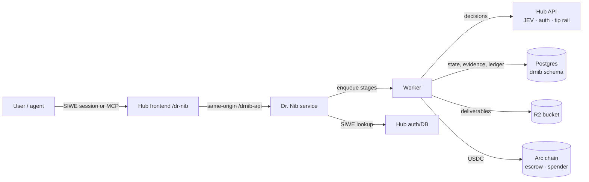
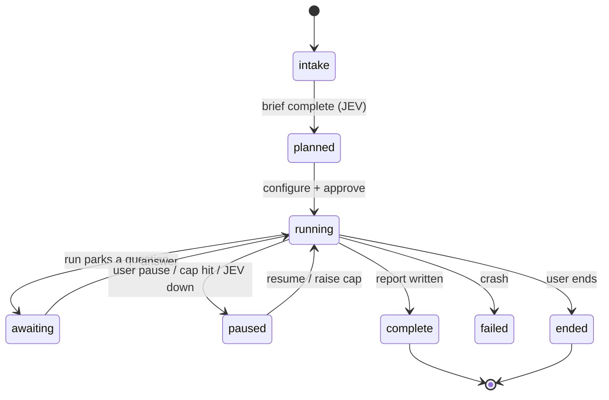

import { Callout } from 'nextra/components'

# Protocol & architecture

Dr. Nib is a research agent *and* the protocol underneath it: a budgeted, auditable agent that buys what it needs, inside policy, and can be commissioned by other agents. This page is the box-and-arrow view — the services, the run lifecycle, the money rails, and where each guarantee is enforced.

## The pieces

- **Hub frontend** — the `/dr-nib` UI (research, projects, sources, settings). It talks to the service through a same-origin proxy so the hub's session cookie just works.
- **Dr. Nib service** — the Express API plus the worker that runs pipeline stages. It has no accounts of its own: identity is the hub's wallet session.
- **Hub API** — the decision seat (JEV), and the rails the agent spends through (tip challenge/verify, x402).
- **Postgres** — runs, evidence, claims, reports, and the append-only ledger, in the service's own `drnib` schema.
- **R2** — rendered deliverables.
- **Arc** — the onchain guarantees: run escrow and the spend mandate.

**Reference:** `dr-nib/backend/src/server.js`, `routes/`, `worker.js`, `db.js`, `env.js`; `dr-nib/ARCHITECTURE.md`.

## Identity is the wallet

There is no Dr. Nib login. The API reads the hub's SIWE session cookie and validates it against the hub's own `Session`/`User` tables (`HUB_DATABASE_URL`) using the same code path the hub uses. Every mutating route is owner-checked and idempotency-keyed, so a retried request can't double-create a run or double-charge a stage. Agent callers reach the same routes over MCP, naming an owner wallet that must own the run.

## The run lifecycle

Stages are durable: state checkpoints to Postgres, the worker is stateless and survives restarts, and the event feed is replayable by `seq` — a client that disconnects at step five reconnects at step six. Pause is cooperative (checked between steps); the run outlives the HTTP request that started it.

<Callout type="info">
**JEV down ≠ model decides.** If the decision seat is unreachable, the run parks with `pauseReason: 'jev'` and the balance untouched. It resumes when the seat is back. See [How JEV decides](./jev).
</Callout>

## The two loops

1. **Intake loop** — one question at a time, each answer folded into a living brief. JEV owns the stop rule (`proceed` / `ask_more` / `reframe`); the loop has no counter.
2. **Research loop** — per round: search → fetch → score → review. The data stage adds a propose → judge → execute loop (model proposes tools, JEV decides, tools execute). Termination is enforced in code with explicit budgets and stop reasons, never requested in prompt prose. See [Agent loop](./agent-loop).

## Money, and where it's enforced

The ledger is the source of truth; contracts are the guarantee:

| Layer | Enforces | Where |
|---|---|---|
| Ledger | per-stage drawdown, 1% fee, raise-only caps, settle/refund | `dr-nib/backend/src/money.js`, `budgets` |
| Software caps | per-call ceilings, run-balance gate, verdict binding, dual-RPC | `spend/policy.js`, `spend/guard.js` |
| Spend mandate | onchain daily cap + recipient allowlist for direct transfers | `NibgateSpender` (Arc testnet) |
| Run escrow | the whole cap locked onchain, atomic split at settle | ERC-8183 core + `NibgateRunSplitter` (Arc testnet) |

A run never overspends — it pauses at the cap and asks. The remainder returns at settle. Escrow is opt-in per run; the ledger path is the default. See [Budgets & refunds](./budgets), [Onchain escrow](./escrow), and [Spending gates](./gates).

## Machine parity

Dr. Nib is agent-facing as well as people-facing. An MCP server exposes the same run flows as tools (`answer_question`, `approve_plan`, `pause_run`, `reprompt_run`, `reconcile_run`, …) that call the same code paths as the HTTP routes — including the same ownership rule. A service key gates the surface; with none set the server runs open for local development and says so, never silently. Agent callers pay in USDC (tips, paid unlocks, x402) from the run budget, inside the same per-call ceilings as the browser flow.

## Deliverables

A finished run keeps its research as raw markdown and generates deliverables from it, never by re-running: **Markdown, JSON, BibTeX, PDF, Word, Excel, PowerPoint**. Binary formats are rendered by the service and stored in the shared R2 bucket, returning a URL; text formats come back inline. The format is chosen *after* the research exists — choosing a format before there is anything to export is guessing.