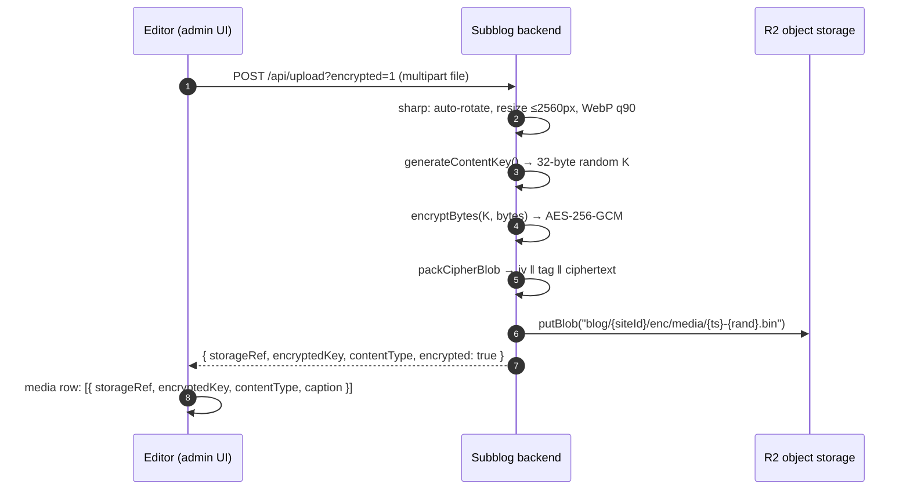
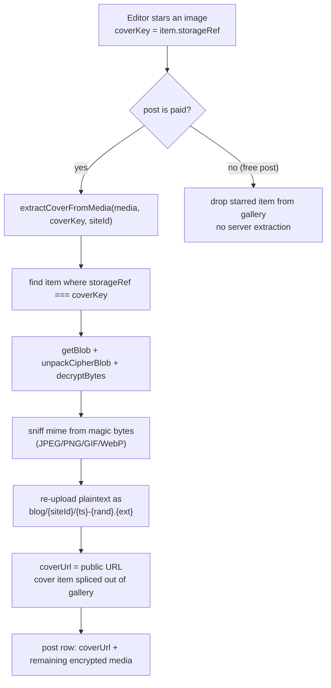

import { Callout, Steps } from 'nextra/components'

# Content encryption

Paid content on Subblogs is encrypted **at rest**: the blog row and object storage never hold a paid body or paid gallery image as plaintext, so a database or storage leak does not expose the content. Only the starred cover is stored in the clear.

All cryptography lives in `@nibgate/sdk/server` (`packages/nibgate/src/server/crypto.js`). The subblog backend uses these primitives, never its own crypto.

## Threat model

Encryption protects against:

- A leaked `blogPost` table or R2 bucket — ciphertext only, no keys in storage.
- A public object-storage URL guessing game — encrypted blobs are served as `application/octet-stream` and the plaintext never lives at a stable public URL.
- Tampering — AES-GCM authenticates ciphertext; a modified blob fails `decryptBytes` with an auth-tag error before any plaintext is produced.

It does **not** prevent: screenshotting during a legitimate unlocked session, or a determined user re-reading content they already paid for. Encryption is confidentiality-at-rest, not DRM.

## Primitives

| Function | Input | Output |
|---|---|---|
| `generateContentKey()` | — | 32 random bytes (AES-256 key) |
| `encryptBytes(key, plaintext)` | key, buffer | `{ iv, tag, ciphertext }` — random 12-byte IV per call, 16-byte GCM tag |
| `packCipherBlob(enc)` | `{ iv, tag, ciphertext }` | single buffer `iv ‖ tag ‖ ciphertext` |
| `unpackCipherBlob(blob)` | blob | `{ iv, tag, ciphertext }` (rejects blobs shorter than 28 bytes) |
| `decryptBytes(key, iv, tag, ciphertext)` | key + blob parts | plaintext buffer (GCM tag verified) |

Keys are persisted as base64 in the DB (`encryptedKey`, `contentKey`) and decrypted server-side only when serving an authenticated request. The blob layout in object storage:

```text
ciphertext blob (.bin, application/octet-stream)
┌──────────────┬──────────────────┬──────────────────────────────┐
│ iv (12 bytes)│ gcm tag (16 bytes)│ ciphertext (len(plaintext))  │
└──────────────┴──────────────────┴──────────────────────────────┘
```

## What is encrypted

| Content | Storage | Key column | Public? |
|---|---|---|---|
| Paid gallery image | `.bin` ciphertext blob, `blog/{siteId}/enc/media/…` | `media[].encryptedKey` (per file) | No |
| Paid post body | `.bin` ciphertext blob, `blog/{siteId}/enc/body/…` | `contentKey` (per post) | No |
| Paid audio | `.bin` ciphertext blob | `audioEncryptedKey` | No |
| Cover image | plaintext WebP, `blog/{siteId}/…` | — | Yes |

## Encrypted media upload

The editor uploads paid-post media to the **encrypted** variant of the upload route (`POST /api/upload?encrypted=1`, `subblogs/backend/src/routes/v1/upload.route.js:102`). The image optimization pipeline runs **before** encryption, so encrypted blobs are already WebP; the ciphertext then replaces the file bytes.



The route returns a `storageRef` (the R2 object key) plus the base64 key; the post's `media` JSON stores **only** `{ storageRef, encryptedKey, contentType, caption }` per item (`normalizeMediaForStorage`, `subblogs/backend/src/services/blog.service.js:26`). No plaintext URL is ever persisted for paid media. Encrypted uploads require R2 to be configured; without it the route answers `400`.

## The cover stays public

The cover is the one image a paid gallery must show without payment — it anchors the feed card, the post page hero, and the lock teaser. It is produced by `extractCoverFromMedia` (`subblogs/backend/src/services/blog.service.js:72`): the starred image's `storageRef` is sent as `coverKey`, the server decrypts that single blob, sniffs its real mime from magic bytes, re-uploads the plaintext, and drops the item from the gallery.



Extraction runs on both create and update when the target state is paid (`blog.service.js:170`, `:253`), so an existing free post can gain a cover when converted. Unpaired `coverKey`s (no matching `storageRef`) fall through silently and leave the gallery untouched.

## Paid body encryption

At create/update time a paid body is encrypted through `encryptBytesToStore` (`blog.service.js:47`) into `contentKey` + `bodyStorageRef`, and the `bodyMarkdown` column is cleared (`blog.service.js:195`). Admin reads decrypt it server-side via `getById` (`blog.service.js:149`) so the editor round-trips; the public API never receives the key material.

## Read path: locked vs unlocked

The public post route returns a teaser for locked posts — `isLocked: true` with `body`, `media`, `contentKey`, and `bodyStorageRef` all `null` (`subblogs/backend/src/controllers/blog.controller.js:30`). Full content only leaves through two proof-gated endpoints:

- `GET /api/nibgate/access?path=…` — runs the x402 pay flow; on success decrypts the body server-side and returns `{ content, media }` where `media` is metadata (`{ photos, hasAudio, audioContentType, hasVideo }`), not file URLs (`nibgate.route.js:37`).
- `GET /api/nibgate/media/:postId/photo?index=N` (or `/audio`) — streams one decrypted asset by gallery index (`nibgate.route.js:166`).

The media route is where the encryption actually pays off:

```mermaid
sequenceDiagram
    autonumber
    participant V as Viewer (browser/agent)
    participant B as Subblog backend
    participant R as R2 object storage

    V->>B: GET /api/nibgate/media/:postId/photo?index=0
    B->>B: load post; resolve media[index] → storageRef + encryptedKey
    B->>B: isPaidValue(price)?
    alt no x-nibgate-payment-proof header
        B-->>V: 402 + payment challenge (createPaymentChallenge)
    else valid unlock proof
        B->>R: getBlob(storageRef)
        B->>B: unpackCipherBlob + decryptBytes(base64 key)
        B-->>V: 200 plaintext · Cache-Control: private, max-age=300
    end
```

The unlock proof is carried in the `x-nibgate-payment-proof` request header and verified by `isUnlocked` (`packages/nibgate/src/server/access.js:45`). The `private` cache directive keeps plaintext out of shared/proxy caches; there is no public object URL for it.

<Callout type="info">
The same `GET /api/nibgate/media/:postId/audio` route decrypts paid audio files; the `/access` response marks them via `media.hasAudio`.
</Callout>

## What stays public

- Cover image (`coverUrl`), served directly from object storage with an immutable cache header.
- Post metadata: title, excerpt, tags, price, slug, type.
- Manifest metadata in `/nibgate.json` and hub discovery cards (title, summary, price).

Everything else on a paid post is either ciphertext in storage or plaintext withheld behind proof.
