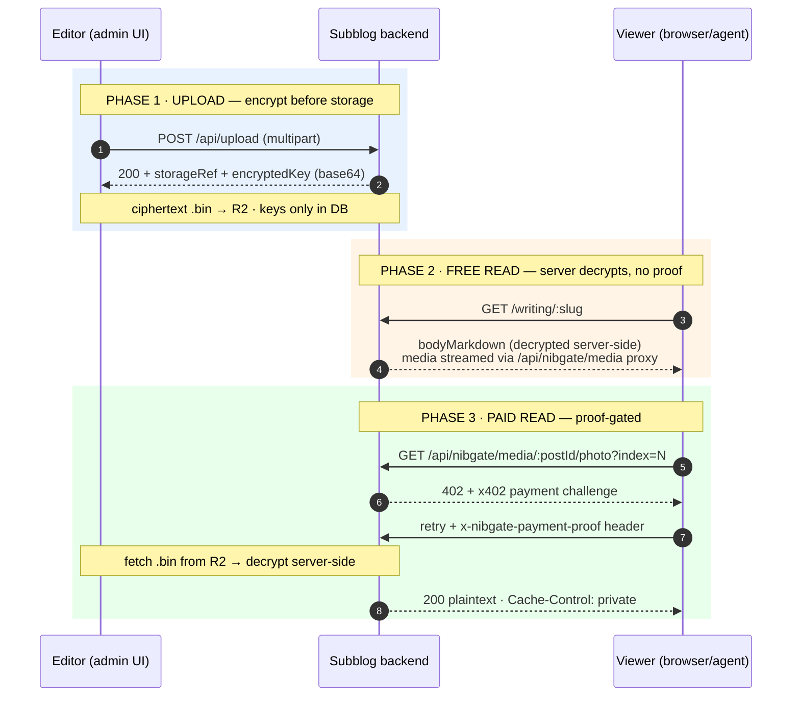
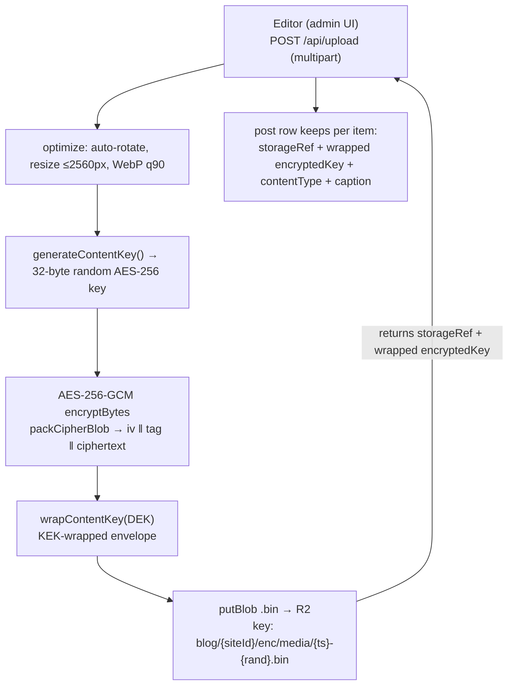
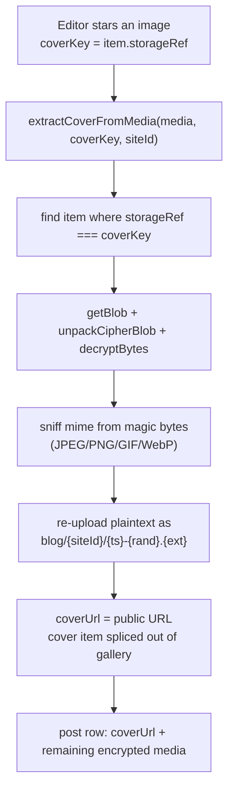
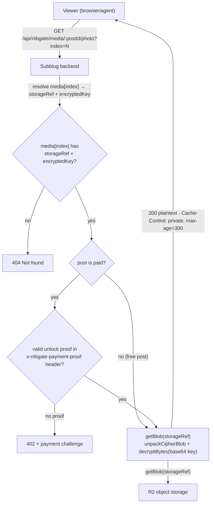

import { Callout } from 'nextra/components'

# Content encryption

All Subblogs content — **free and paid** — is encrypted **at rest**: the blog row and object storage never hold a post body, gallery image, audio file, uploaded video, or document as plaintext, so a database or storage leak does not expose the content. Only the starred cover image is stored in the clear.

All cryptography lives in `@nibgate/sdk/server` (`packages/nibgate/src/server/crypto.js`). The subblog backend uses these primitives, never its own crypto.

Encryption is **confidentiality at rest, not access control**. Free posts are decrypted server-side and served to anyone who visits; paid posts are additionally gated behind proof-of-payment. In plain terms: before a post's body or media reaches object storage, the server scrambles it with AES-256-GCM and keeps the keys out of every public response. A viewer gets free content plaintext with no proof, and paid content plaintext only after presenting proof of payment — streamed one asset at a time. The one exception is the cover image, which stays public to anchor the teaser.

## The lifecycle at a glance



## Threat model

Encryption protects against:

- A leaked `blogPost` table or R2 bucket — ciphertext only, no keys in storage.
- A public object-storage URL guessing game — encrypted blobs are served as `application/octet-stream` and the plaintext never lives at a stable public URL.
- Tampering — AES-GCM authenticates ciphertext; a modified blob fails `decryptBytes` with an auth-tag error before any plaintext is produced.

It does **not** prevent: screenshotting during a legitimate viewing session, or a determined user re-reading content they already paid for. Encryption is confidentiality-at-rest, not DRM.

## Primitives

| Function | Input | Output |
|---|---|---|
| `generateContentKey()` | — | 32 random bytes (AES-256 key) |
| `encryptBytes(key, plaintext)` | key, buffer | `{ iv, tag, ciphertext }` — random 12-byte IV per call, 16-byte GCM tag |
| `packCipherBlob(enc)` | `{ iv, tag, ciphertext }` | single buffer `iv ‖ tag ‖ ciphertext` |
| `unpackCipherBlob(blob)` | blob | `{ iv, tag, ciphertext }` (rejects blobs shorter than 28 bytes) |
| `decryptBytes(key, iv, tag, ciphertext)` | key + blob parts | plaintext buffer (GCM tag verified) |
| `wrapKey(secret, key)` / `unwrapKey(secret, wrapped)` | KEK + raw key | envelope-encrypted key (iv ‖ tag ‖ wrapped, base64) |

Keys are wrapped server-side before they are persisted: each post/file is encrypted with its own random content key (DEK), and the DEK is itself encrypted with a backend-only key-wrapping key (KEK) derived from `NIBGATE_SHARE_KEY_SECRET`. Only the wrapped DEK is stored (`encryptedKey`, `contentKey`, `audioEncryptedKey`, `documentEncryptedKey`, `videoEncryptedKey`), so a database dump alone cannot decrypt the R2 ciphertext — the KEK never leaves the backend and never touches content. The wrap is transparent on the read path (`storedToKey` in `subblogs/backend/src/lib/keywrap.js` still accepts pre-envelope 32-byte keys so old rows keep working). The blob layout in object storage:

```text
ciphertext blob (.bin, application/octet-stream)
┌──────────────┬──────────────────┬──────────────────────────────┐
│ iv (12 bytes)│ gcm tag (16 bytes)│ ciphertext (len(plaintext))  │
└──────────────┴──────────────────┴──────────────────────────────┘
```

## What is encrypted

Every post body and uploaded media file is encrypted, whether the post is free or paid. Only external embeds and the cover stay plaintext.

| Content | Storage | Key column | Public? |
|---|---|---|---|
| Gallery image (all posts) | `.bin` ciphertext blob, `blog/{siteId}/enc/media/…` | `media[].encryptedKey` (per file) | No |
| Post body (all posts) | `.bin` ciphertext blob, `blog/{siteId}/enc/body/…` | `contentKey` (per post) | No |
| Audio file (all posts) | `.bin` ciphertext blob | `audioEncryptedKey` | No |
| Document (all posts) | `.bin` ciphertext blob | `documentEncryptedKey` | No |
| Uploaded video file (all posts) | `.bin` ciphertext blob | `videoEncryptedKey` | No |
| YouTube embed URL | plaintext metadata `videoUrl` | — | Yes (external embed on YouTube) |
| Cover image | plaintext WebP, `blog/{siteId}/…` | — | Yes |

Video posts that use a YouTube URL only store the external `videoUrl` — the actual video lives on YouTube, so there is nothing to encrypt. Uploaded video files are encrypted like any other media.

## Encrypted media upload

The editor uploads all post media to the **encrypted** upload route (`POST /api/upload`, `subblogs/backend/src/routes/v1/upload.route.js:78`). The route always encrypts when R2 is configured — there is no `?encrypted=1` flag anymore. The image optimization pipeline runs **before** encryption, so encrypted blobs are already WebP; the ciphertext then replaces the file bytes.



The route returns a `storageRef` (the R2 object key) plus the KEK-wrapped key; the post's `media` JSON stores **only** `{ storageRef, encryptedKey, contentType, caption }` per item (`normalizeMediaForStorage`, `subblogs/backend/src/services/blog.service.js:26`). No plaintext URL or raw key is ever persisted for gallery media, audio, video, or documents. When R2 is not configured (local dev only), the route falls back to a plaintext file under `/uploads/` and returns `{ url }` — encryption is on the same switch as R2 (`ENCRYPT_ENABLED`).

## The cover stays public

The cover is the one image a gallery must show without payment — it anchors the feed card, the post page hero, and the lock teaser. It is produced by `extractCoverFromMedia` (`subblogs/backend/src/services/blog.service.js:62`): the starred image's `storageRef` is sent as `coverKey`, the server decrypts that single blob, sniffs its real mime from magic bytes, re-uploads the plaintext, and drops the item from the gallery.



Extraction runs on both create and update whenever a cover is starred and R2 is enabled (`blog.service.js:169`, `:255`) — it is not limited to paid posts. Unpaired `coverKey`s (no matching `storageRef`) fall through silently and leave the gallery untouched.

## Body encryption

At create/update time the body is encrypted through `encryptBytesToStore` (`blog.service.js:37`) into `contentKey` + `bodyStorageRef`, and the `bodyMarkdown` column is cleared (`blog.service.js:206`). Admin reads decrypt it server-side via `getById` (`blog.service.js:143`) so the editor round-trips. The public free-read path decrypts it too — see below.

## Read path: free vs locked

The difference between free and paid is only at serve time.

**Free posts** — `GET /api/blog/posts/:slug` decrypts the body server-side and returns it (`getBySlug`, `blog.service.js:117`; `blog.controller.js:32`). Media is streamed through the encrypted-media proxy without any proof:

- `GET /api/nibgate/media/:postId/photo?index=N` (also `/video`, `/audio`) — decrypts one asset by gallery index and streams it (`nibgate.route.js:174`).

**Paid posts** — `GET /api/blog/posts/:slug` returns a teaser: `isLocked: true` with `body`, `media`, `contentKey`, and `bodyStorageRef` all `null` (`blog.controller.js:28`). Full content only leaves through two proof-gated endpoints:

- `GET /api/nibgate/access?path=…` — runs the x402 pay flow; on success decrypts the body server-side and returns `{ content, media }` where `media` is metadata (`{ photos, hasAudio, audioContentType, hasVideo, hasDocument, documentName, documentSize, documentContentType }`), not file URLs (`nibgate.route.js:73`).
- `GET /api/nibgate/media/:postId/photo?index=N` (or `/video`, `/audio`) — streams one decrypted asset, but only with a valid proof in the `x-nibgate-payment-proof` header (`nibgate.route.js:174`).

Documents follow the same split (`nibgate.route.js:256`, `:271`): free documents render in full without proof; paid documents show a truncated preview (12 rows for sheets, 1600 chars for text) without proof, and the full render/download behind proof.

The media route is where the encryption actually pays off:



The unlock proof is carried in the `x-nibgate-payment-proof` request header and verified by `isUnlocked` (`packages/nibgate/src/server/access.js:45`). The `private` cache directive keeps plaintext out of shared/proxy caches; there is no public object URL for it.

## What stays public

- Cover image (`coverUrl`), served directly from object storage with an immutable cache header.
- Post metadata: title, excerpt, tags, price, slug, type.
- Manifest metadata in `/nibgate.json` and hub discovery cards (title, summary, price).
- YouTube embed URLs (external embeds).

Everything else on a post is ciphertext in storage. Posts created before encryption shipped were stored as plaintext; re-saving a post re-encrypts it in place, and the production migration script converts the rest without changing any URLs.
