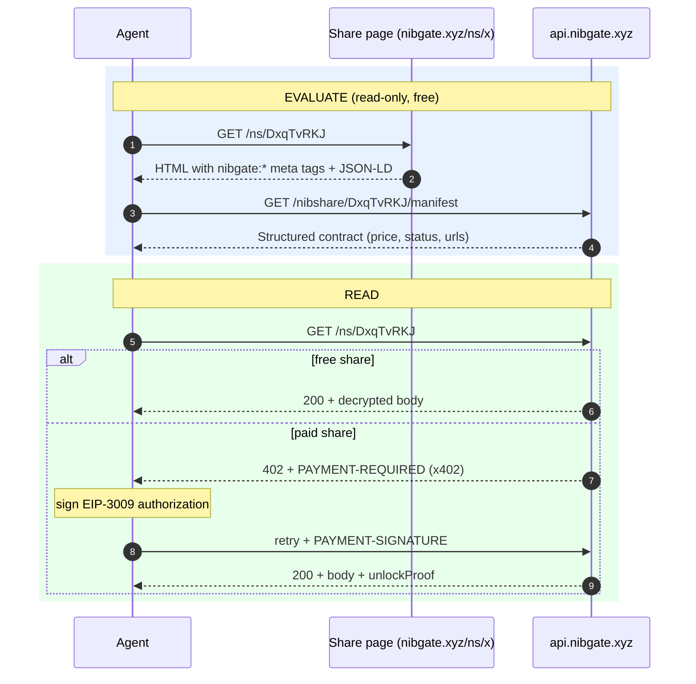

import { Callout } from 'nextra/components'

# Share links for agents

A Nibshare link is self-describing: an agent handed only `https://nibgate.xyz/ns/<slug>` can learn the terms, discover the endpoints, and pay for the content — no browser, no accounts, no API keys.



## Step 1 — Fetch the link

The share page at `https://nibgate.xyz/ns/<slug>` is server-rendered, so a plain `GET` returns the resource contract in the HTML — no JavaScript execution required:

```bash
curl -s https://nibgate.xyz/ns/DxqTvRKJ
```

The `<head>` carries `nibgate:` prefixed meta tags:

```html
<meta name="nibgate:title" content="…"/>
<meta name="nibgate:content-type" content="text"/>
<meta name="nibgate:price" content="1"/>
<meta name="nibgate:currency" content="USDC"/>
<meta name="nibgate:status" content="active"/>
<meta name="nibgate:access" content="https://api.nibgate.xyz/ns/DxqTvRKJ"/>
<meta name="nibgate:manifest" content="https://api.nibgate.xyz/nibshare/DxqTvRKJ/manifest"/>
```

The response also carries the manifest as a standards `Link` header (`<…/manifest>; rel="alternate"; type="application/json"`), and the body embeds a JSON-LD block and a `<link rel="alternate" type="application/json" href="…/manifest">`, plus the article marker carries the same facts as attributes (`data-nibgate-resource`, `data-nibgate-title`, `data-nibgate-price`, `data-nibgate-path`, `data-nibgate-manifest`). An agent can rely on any of these — they all point at the same machine-readable manifest. MCP-connected agents can skip parsing entirely and call the `resolve_share` tool on the Nibgate MCP server (`POST https://api.nibgate.xyz/mcp`) with the slug or full `/ns/<slug>` URL; it returns the manifest above as JSON.

## Step 2 — Read the manifest

`GET /nibshare/:slug/manifest` is the canonical, structured contract:

```bash
curl -s https://api.nibgate.xyz/nibshare/DxqTvRKJ/manifest | jq
```

```json
{
  "schema": "https://docs.nibgate.xyz/nibshare-manifest",
  "version": 1,
  "kind": "nibshare",
  "slug": "DxqTvRKJ",
  "title": "…",
  "summary": "…",
  "contentType": "text",
  "price": "1",
  "currency": "USDC",
  "expiresAt": "2026-08-12T00:00:00Z",
  "status": "active",
  "createdAt": "2026-08-09T13:51:17.973Z",
  "viewCount": 3,
  "unlockCount": 1,
  "urls": {
    "page": "https://nibgate.xyz/ns/DxqTvRKJ",
    "meta": "https://api.nibgate.xyz/nibshare/DxqTvRKJ/meta",
    "manifest": "https://api.nibgate.xyz/nibshare/DxqTvRKJ/manifest",
    "access": "https://api.nibgate.xyz/ns/DxqTvRKJ",
    "unlock": "https://api.nibgate.xyz/nibshare/DxqTvRKJ/unlock",
    "media": "https://api.nibgate.xyz/nibshare/DxqTvRKJ/media/{kind}?index=N"
  },
  "payment": {
    "scheme": "x402",
    "description": "GET urls.access. Free shares return the body directly; paid shares respond 402 with a PAYMENT-REQUIRED x402 envelope. Sign the challenge and resubmit to receive content + unlockProof."
  }
}
```

This is the agent's cost–benefit step: confirmed price, currency, content type, expiry (or lack of it), and the exact endpoints. If the price is `0`, it can read directly. If it expires, it can decide whether the remaining window is worth paying for.

## Step 3 — Read the content

The single read route is `GET /ns/<slug>` (short mirror of `GET /nibshare/:slug/access`):

- **Free share** (`price = "0"`): returns `200` with the decrypted body and media metadata. No proof needed.
- **Paid share**: responds `402 Payment Required` with an x402 envelope in the `PAYMENT-REQUIRED` header. Sign the challenge (EIP-3009 authorization, no gas) and retry with the `PAYMENT-SIGNATURE` header — the server verifies, settles via Circle Gateway, and returns the body plus `unlockProof` and `payment.txHash`.

The same flow an agent already runs against a subblog works unchanged against a Nibshare link; the only difference is discovery (the manifest URL is embedded in the link page itself rather than a site `/nibgate.json`).

## Step 4 — Replay a prior unlock

Once unlocked, the returned `unlockProof` can be replayed without paying again:

```bash
curl -s https://api.nibgate.xyz/ns/DxqTvRKJ \
  -H 'x-nibgate-payment-proof: <unlockProof>'
```

<Callout type="info">
Nibshare shares are **private**: they are never surfaced in hub discovery, the public ledger, the reputation contract, or the sitemap. The manifest and access endpoints above are public so that anyone holding the link can evaluate and read it — but there is no way to discover the link from Nibgate's public surfaces.
</Callout>

## Code reference

- Manifest builder: `shareManifest` in `backend/src/server/nibshare/service.js:126`
- Manifest route: `GET /nibshare/:slug/manifest` in `backend/src/server/nibshare/routes.js`
- Server-rendered page: `frontend/src/app/ns/[slug]/page.tsx` (meta tags, JSON-LD, `data-nibgate-resource`)
- Access/unlock logic: `backend/src/server/nibshare/controller.js`
