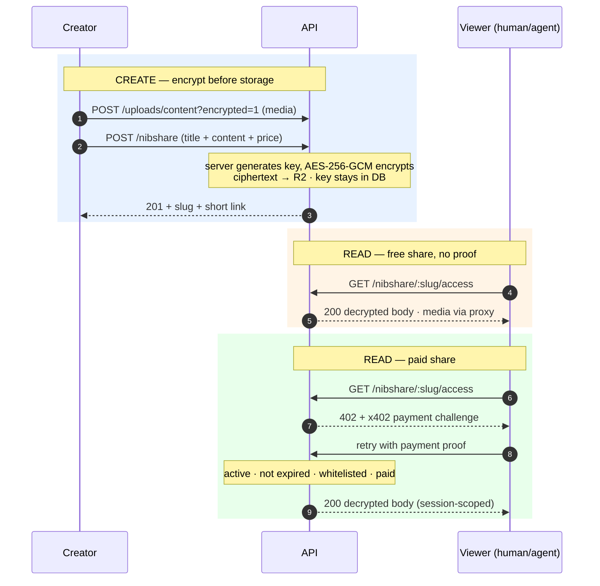
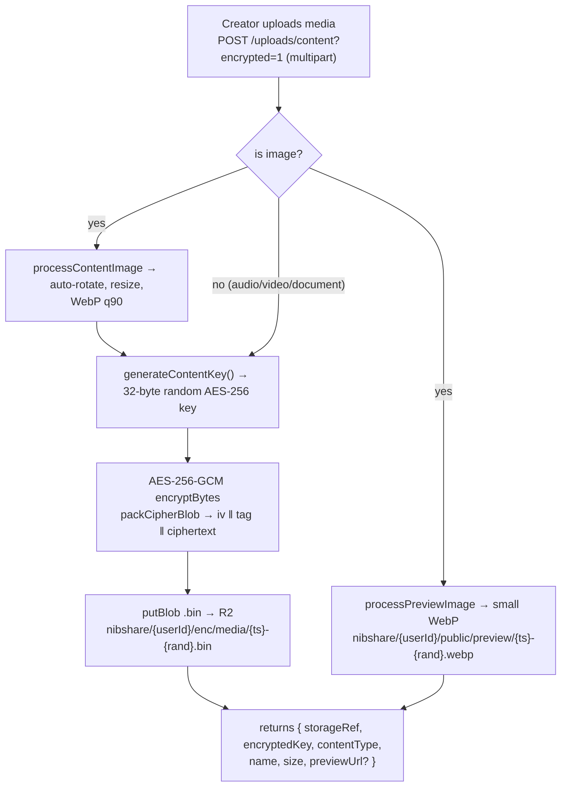
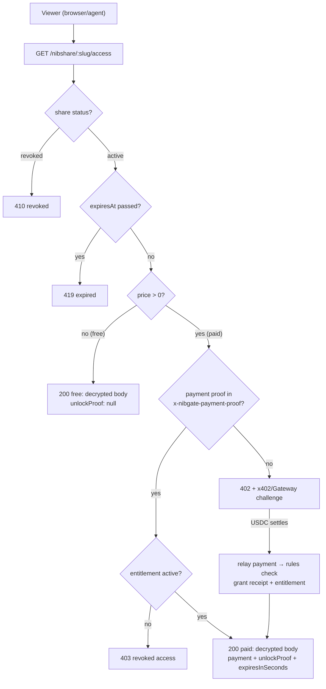
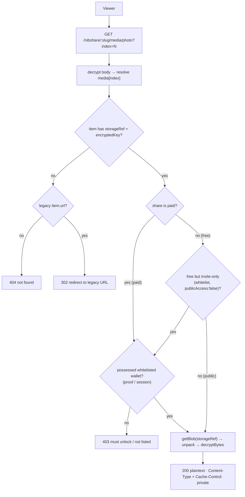
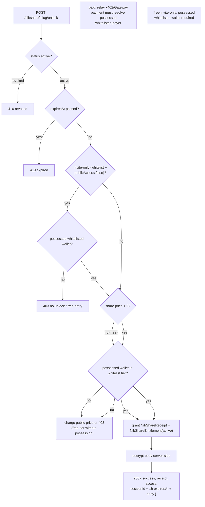
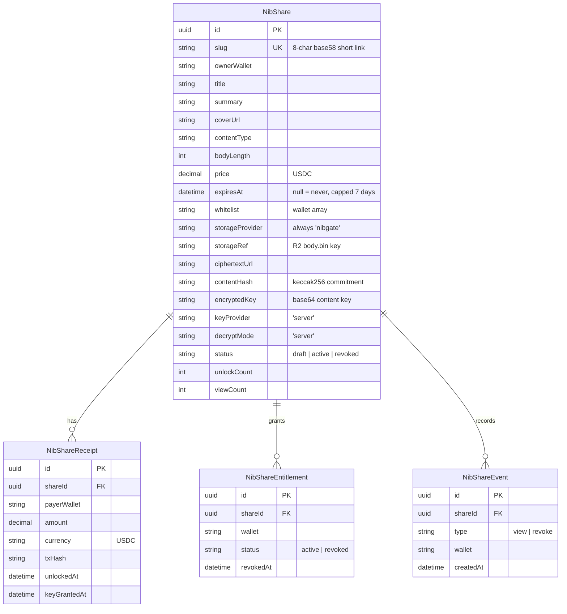

import { Callout, Cards } from 'nextra/components'

# Nibshare

Nibshare is Nibgate's hosted **quick-share** rail: connect a wallet, write content, set a USDC price, and get a short link at `https://nibgate.xyz/ns/<slug>`. No domain, widget, or site verification required — it is the on-ramp for "gate this snippet fast."

It runs on the same rails as the rest of Nibgate: x402 / USDC / Circle Gateway payments on Arc (`eip155:5042002`), AES-256-GCM encryption at rest, and a viewer/agent unlock flow. The difference: Nibgate hosts and serves everything, so there is no creator-owned domain behind it.

<Callout type="important">
Nibshare is a **separate, private rail** — it is never indexed in hub discovery, the public ledger, or on-chain reputation. Shares are ephemeral (expiry is optional but capped at 7 days) and have no creator-verified domain. Subblogs and creator sites are the indexed products; Nibshare is for quick gated sharing.
</Callout>

## When to use Nibshare vs a Subblog

| | Nibshare | Subblog |
|---|---|---|
| Domain required | No — short link `nibgate.xyz/ns/<slug>` | Yes — `*.nibgate.xyz` or your own |
| Indexed in discovery/ledger/reputation | No | Yes |
| Content lifetime | Optional expiry, capped at 7 days | Persistent |
| Access rail | x402 / Circle Gateway on Arc | x402 / Circle Gateway on Arc |
| Encryption at rest | All bodies + media | All bodies + media |
| Ownership check | Wallet session cookie | Site verification + admin wallet |

## How sharing works



## Encryption at rest

Same policy as Subblogs: **no plaintext body or media ever touches object storage**. All cryptography comes from `@nibgate/sdk/server` (`packages/nibgate/src/server/crypto.js`) — the nibshare backend never implements its own crypto.

- Every share body and every uploaded media file is encrypted with **AES-256-GCM** (random 12-byte IV per call, 16-byte GCM auth tag).
- Keys are **server-side only** (`keyProvider: 'server'`, `decryptMode: 'server'`): the content key is generated by the backend, **wrapped with a backend-only KEK** (`NIBGATE_SHARE_KEY_SECRET`) before it is stored, and decryption happens per request. No key or ciphertext is ever vended to the browser.
- A modified blob fails the GCM auth-tag check before any plaintext is produced.

### Primitives

| Function | Input | Output |
|---|---|---|
| `generateContentKey()` | — | 32 random bytes (AES-256 key) |
| `encryptBytes(key, plaintext)` | key, buffer | `{ iv, tag, ciphertext }` |
| `packCipherBlob(enc)` | `{ iv, tag, ciphertext }` | single buffer `iv ‖ tag ‖ ciphertext` |
| `unpackCipherBlob(blob)` | blob | `{ iv, tag, ciphertext }` (rejects blobs < 28 bytes) |
| `decryptBytes(key, iv, tag, ciphertext)` | key + blob parts | plaintext buffer (GCM tag verified) |

Ciphertext blob layout:

```text
ciphertext blob (.bin, application/octet-stream)
┌──────────────┬──────────────────┬──────────────────────────────┐
│ iv (12 bytes)│ gcm tag (16 bytes)│ ciphertext (len(plaintext))  │
└──────────────┴──────────────────┴──────────────────────────────┘
```

### Upload & encrypt pipeline

Media uploads go through `POST /uploads/content?encrypted=1`. Images are optimized to WebP **before** encryption; the preview WebP is the only public plaintext byte for a share.



### Storage layout

| Key | Content | Access |
|---|---|---|
| `nibshare/{id}/body.bin` | Ciphertext of the share body | private — read via server decrypt |
| `nibshare/{userId}/enc/media/{fileId}.bin` | Encrypted media item | private — read via server decrypt |
| `nibshare/{userId}/public/preview/{fileId}.webp` | Plaintext WebP preview (images only) | public CDN, immutable cache |

## Free vs paid reads

The difference is only at serve time, exactly like Subblogs:

- **Free shares** (`price = "0"`): `GET /nibshare/:slug/access` decrypts the body server-side and returns it. Public shares need **no proof**; **invite-only** free shares (`whitelist` + `publicAccess: false`) require a possession-corroborated whitelisted wallet (session or proof) → `403`.
- **Paid shares**: the same route relays the x402 Gateway challenge until payment. After USDC settles, the server checks the rules and returns the decrypted body scoped to that session. A whitelist turns it into a **tier** — whitelisted wallets pay `whitelistPrice` instead of `price`; invite-only paid shares demand a whitelisted (and possessed) payer before any charge.



## Payment proofs

After a paid unlock, the server returns an `unlockProof` that the viewer stores and replays on later reads (including media):

```text
{wallet}.{iat}.{exp}.{mac}   e.g. 0xabc...A7F3.1786123456.1786172256.5x2fYv...
```

`mac = HMAC-SHA256("nibshare:{shareId}:{wallet}:{iat}:{exp}")` keyed with a backend-only secret. The `iat`/`exp` claims pin the proof to a 12-hour window (mirroring the SDK's `DEFAULT_UNLOCK_SECONDS`); tampering with either claim breaks the MAC. Legacy `{wallet}.{mac}` proofs (no claims, never expire) still verify for back-compat. Expiry is **harmless** — entitlements (rule 6/7) decide access before any proof check, so an expired proof is simply re-minted on the next legit visit.

The proof is sent back in the `x-nibgate-payment-proof` header (media also accepts `?proof=`). The server recomputes the MAC and looks up the wallet's entitlement — the proof only replays while that wallet's entitlement is `active`.

### Wallet possession

A bare `?wallet=` / `walletAddress` parameter is a client **claim**, never an identity. A claim may only influence pricing (whitelist tier, invite-only eligibility) and never grant content on its own. Granting paths — free **invite-only** reads, **lifetime** re-issue, whitelist **free-tier** grants, and **media** — require proof of possession, which is one of:

1. a valid, bound `unlockProof` for that wallet, or
2. a SIWE session (`auth_session` cookie) whose wallet matches the claim.

The unlock flow connects + SIWE-signs in before unlocking, so the session is normally present. A wallet with a stored proof keeps working without a session. If neither exists, an anonymous view of a paid share is charged the **public** price and paid wallets are never granted to a bare claim.

## Media streaming

Embedded assets stream through a decrypt proxy — the plaintext never lives at a stable public URL. Body references use `nibgate-embed://N` tokens; the viewer rewrites them to this route.

`GET /nibshare/:slug/media/:kind?index=N`

| `kind` | Resolves to |
|---|---|
| `photo` | `body.media[index]` (encrypted `{ storageRef, encryptedKey }`) |
| `music` | `body.audio` |
| `video` | `body.file` |
| `document` | `body.document` |

- Free **public** shares stream with no proof.
- **Paid** shares require an active entitlement (valid proof, or `?wallet=` corroborated by the SIWE session, or a verified payer) → `403` otherwise.
- **Free invite-only** shares require a possession-corroborated whitelisted wallet (proof or session) → `403`.
- Responses are `Cache-Control: private, max-age=300`; documents/video also set `Content-Disposition` (`?download=1` → `attachment`, else `inline`). Decrypted **bodies** (access/unlock) are served with `Cache-Control: private, no-store` so a shared proxy/CDN can never replay a paid or invite-only 200 to a non-payer.
- Legacy shares (pre-encryption, plaintext `url` fields) redirect to the stored URL.



## Access rules

All checks run server-side at unlock/access time:

- `status` is `active` (revoked shares → `410 Gone`)
- not past `expiresAt` (→ `419`, "no new unlocks after expiry")
- access granted only to a wallet that **possesses** the route's identity (session match, valid proof, or a verified payer) — a bare `?wallet=` claim never grants content
- **whitelist semantics** depend on `publicAccess`:
  - `publicAccess: true` — whitelist is a **price tier**: whitelisted wallets pay `whitelistPrice`, everyone else pays `price` (whitelist-free tier `whitelistPrice = 0` additionally requires possession, so it is invite-only in practice)
  - `publicAccess: false` (**invite-only**) — a non-whitelisted wallet gets `403` **before any charge or free grant**; free invite-only reads and free-tier grants require a possessed whitelisted wallet
- payment received for paid shares

**Expiry** stops *new* unlocks and sessions; it never revokes access already granted. Because the backend holds the key and decrypts per request, revoking a wallet's entitlement is a **hard** stop — the content stops being served to it. This is the hosted `server`-mode trade: clean revocation, but Nibgate serves every read. A future `client` mode (decentralized keys/storage) would relax that but cannot take a decrypted copy back.



## Auth

Creating and managing shares uses a wallet session: a nonce-based SIWE (EIP-4361) wallet login establishes an `auth_session` cookie (30 days). Owner-only routes (revoke entitlement, revoke share, reslug, list mine) check that the session wallet owns the share. Reading generally needs no session — except where content is gated to a class of wallets: invite-only free reads, lifetime re-issue, and free-tier grants all require the session wallet (or a valid proof) to **possess** the claimed wallet.

| Scenario | Credential |
|---|---|
| Create / upload / manage | `auth_session` cookie (owner wallet) |
| View, meta, free public read | none |
| Free invite-only read / free-tier grant / lifetime re-issue | `auth_session` possessing the whitelisted wallet, or valid `unlockProof` |
| Paid unlock | x402 payment (or stored proof) |
| Media replay | `x-nibgate-payment-proof` (or `?proof=`, or `?wallet=` + session) |

## Data model



`contentHash = keccak256("nibshare:v1|{ownerWallet}|{storageRef}|{plaintext}")` (`contentHashFor`, `packages/nibgate/src/server/crypto.js`) — the same commitment pattern as the hub's `Content` rows.

## Limits

| Content | Cap | Enforcement |
|---|---|---|
| Share body (text/article) | 512 KB | `POST /nibshare` |
| Media per item | 30 MB | multer `fileSize` on `POST /uploads/content` |
| Expiry | optional, ≤ 1 week (168h) from now | `POST /nibshare` |


## API surface

Base URL: `https://api.nibgate.xyz`. Routes live under `/nibshare/*`, plus the media upload route under `/uploads`. Creating and managing shares uses the Nibgate wallet session cookie (`auth_session`, nonce-based SIWE (EIP-4361) login, 30 days); owner-only routes also check that the session wallet owns the share.

| Endpoint | Purpose |
|---|---|
| `POST /uploads/content?encrypted=1` | Upload media — encrypted for gated shares (images are WebP-optimized before encryption) |
| `POST /nibshare` | Create a share (title + content + price; optional whitelist / expiry ≤ 7 days) |
| `GET /nibshare/:slug/meta` | Public metadata — title, price, cover, status, view/unlock counts. Never the body |
| `GET /nibshare/:slug/manifest` | Machine-readable agent contract — schema, pricing, expiry, status, and the page/access/unlock/media URLs for this share |
| `GET /nibshare/:slug/access` | The single read route: free shares open, paid shares relay the x402 challenge |
| `POST /nibshare/:slug/unlock` | Pay (or `walletAddress` for free) → receipt + entitlement → decrypted body |
| `GET /nibshare/:slug/media/:kind?index=N` | Stream one decrypted asset (`photo` / `music` / `video` / `document`) |
| `POST /nibshare/:slug/view` | Record a view (increments `viewCount`) |
| `POST /nibshare/:slug/entitlements/:wallet/revoke` | Owner: hard-stop one wallet in `server` mode |
| `DELETE /nibshare/:slug` | Owner: revoke the share and delete its R2 body blob |
| `POST /nibshare/:slug/reslug` | Owner: rotate the short-link slug |
| `GET /nibshare/mine` | Owner: list shares + unlock/view activity |
| `GET /nibshare/dashboard?from=&to=` | Owner: analytics across all shares — lifetime summary, range + daily time series, per-share breakdown, recent activity |
| `GET /nibshare/stats` | Public platform aggregates: lifetime totals, 24h/7d windows, truncated-wallet activity feed (no titles, slugs, or full wallets) |

Paid responses carry an `unlockProof` (`{wallet}.{iat}.{exp}.{mac}`) the viewer replays on later reads and media. Share slugs are 8-char base58 short links. Full payload shapes, error codes, and status semantics live with the code in `backend/src/server/nibshare/API.md`.

## Related

- Full API reference (payloads, errors): `backend/src/server/nibshare/API.md`
- Storage & encryption detail: `backend/src/server/nibshare/STORAGE.md`
- Planned Arweave/Lit tiers: `backend/src/server/nibshare/STORAGE-TIER-PLAN.md`
- Payments rail: `backend/src/server/routes/hub-routes.js` (`/hub/pay`)
- Integrity commitment: `packages/nibgate/src/server/crypto.js`
