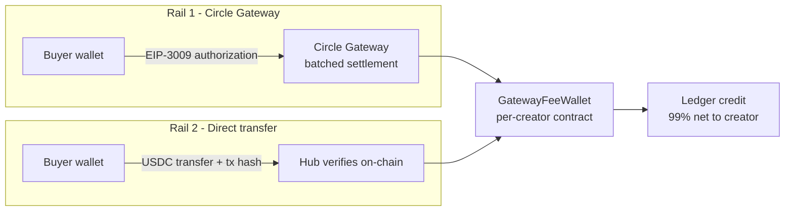
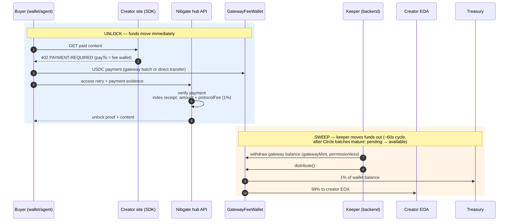

import { Callout, Cards, Steps } from 'nextra/components'

# Revenue model

How a payment becomes spendable creator funds on Nibgate: per-creator **fee wallet contracts**, an on-chain **1% protocol fee**, and a **keeper** that sweeps settled balances to creator wallets. The same model covers both payment rails.

<Callout type="important">
Nibgate never custodies creator funds and cannot move them. Payments land in a contract owned by nobody — the split is enforced by immutable bytecode, not by policy.
</Callout>

## The fee wallet

Every creator gets one **`GatewayFeeWallet`** contract, deployed deterministically (CREATE2) by the **`GatewayFeeWalletFactory`** from the creator's address. The wallet is the payment destination (`payTo`) for all of that creator's paid content:

```txt
creator EOA 0x9c37...  ──deploy──▶  GatewayFeeWallet 0xd03e...
                                    ├─ receives 100% of payments
                                    ├─ keeps 99% for the creator
                                    └─ routes 1% to the treasury
```

Key properties (all enforced on-chain, see `contracts/GatewayFeeWallet.sol`):

- **Immutable** — no proxy, no admin, no upgrade path. Only `feeBps` is mutable, only by the `feeSetter`, and capped at `maxFeeBps` which is frozen at deploy.
- **Split at distribution** — `distribute()` sends `(100% − feeBps)` to the creator EOA and `feeBps` to the treasury in one atomic call. Rounding dust favors the creator.
- **Permissionless operations** — anyone can call `distribute()`; liveness does not depend on Nibgate running.
- **ERC-1271 restricted** — the wallet's `isValidSignature` only authorizes transfers *from itself*. It can never be tricked into signing arbitrary transfers from other addresses, so it is safe to use as an x402 `payTo` signer context.
- **Factory-guaranteed address** — `deployIfNeeded(creator)` is idempotent and permissionless; the hub can predict the wallet address off-chain without a transaction.

Defaults: `feeBps = 100` (1%), `maxFeeBps = 500` (5%). Configurable via env, never above the deployed cap.

## Both rails pay the fee wallet

The two rails differ only in how the buyer's USDC moves. They converge on the same destination:



- **Gateway rail** — buyer signs an EIP-3009 authorization; Circle batches settlements. The challenge's `payTo` is the fee wallet. Batched funds sit in Circle's `pendingBatch` until they mature to `available` (minutes on testnet); only then can the keeper mint them into the wallet. Sweeping earlier is a no-op, not a failure — the balance is picked up on a later cycle.
- **Direct rail** — buyer broadcasts a plain USDC `transfer` to the fee wallet; the server verifies the mined `Transfer` log before minting the unlock proof. Funds are on-chain instantly but still wait for the next `distribute()` to reach the creator EOA.

In both cases the receipt records `payTo` (the fee wallet), the gross amount, and `protocolFee` (the 1% share) so analytics match on-chain reality exactly.

<Callout type="important">
**Direct-rail payments are public chain data.** A txHash alone proves a payment
*happened*, not that *you* made it or what it was *for*. Unlock requests over
the direct rail therefore require (1) an ownership signature from the paying
wallet (`x-nibgate-tx-owner`, EIP-191 over `tx:<hash>` + resource path) and
(2) each txHash is claimed by the hub for exactly one piece of content — reuse
against any other post or site is rejected. The gateway rail is inherently
bound: every payment is an EIP-3009 signature with a per-payment nonce.
</Callout>

## Payment → payout lifecycle



<Steps>
### Unlock
The site's SDK returns a 402 with the creator's fee wallet as `payTo`. The buyer pays; funds land in the fee wallet contract and the hub indexes a receipt with the gross `amount` and the derived `protocolFee`.

### Discovery
The keeper periodically lists creators whose wallets can earn revenue (from indexed data, not chain scans) and predicts each creator's fee wallet address.

### Sweep + distribute
For each creator the keeper withdraws any pending Circle Gateway balance into the wallet (`gatewayMint`, permissionless), then calls `distribute()`. The contract splits its full USDC balance atomically: creator EOA gets 99%, treasury gets 1%. Failures are isolated per creator and retried next cycle.
</Steps>

## Configuration

| Env var | Default | Meaning |
| --- | --- | --- |
| `NIBGATE_HOSTED_PAY` | `false` | Route challenges through the hub's hosted-pay resolver (fee wallet as `payTo`). |
| `NIBGATE_FEE_WALLET_FACTORY` | — | Deployed `GatewayFeeWalletFactory` address. Required for hosted pay. |
| `NIBGATE_TREASURY` | `0x558e…D12` | Protocol fee recipient used when predicting/deploying wallets. |
| `NIBGATE_FEE_BPS` | `100` | Protocol fee in basis points announced in challenges (capped by the contract). |
| `NIBGATE_MAX_FEE_BPS` | `500` | Upper bound announced at deploy; the contract enforces this forever. |
| `NIBGATE_FEE_KEEPER` | unset | Any non-empty value enables the background keeper sweep loop. |
| `NIBGATE_KEEPER_PRIVATE_KEY` | unset | Keeper's signing key (gas-only; holds no user funds, no special contract rights). |
| `NIBGATE_FEE_KEEPER_INTERVAL_MS` | `60000` | Sweep cadence. |
| `NIBGATE_FEE_KEEPER_STAGGER_MS` | `400` | Pause between per-creator sweeps (RPC rate-limit protection). |
| `NIBGATE_FEE_KEEPER_MIN_GHOST_USDC` | `0.05` | Minimum balance for the keeper to auto-recover a second-generation ("ghost") fee wallet by deploying it and distributing to the first-generation wallet. |
| `NIBGATE_DISABLE_KEEPER` | unset | Set to `true` to stop the sweep loop (payment-flow e2e uses this so sweeps can't drain ledgers mid-run). |
| `NIBGATE_TX_CONFIRMATIONS` | chain-aware | Override direct-rail confirmation depth (Arc needs none — see finality section). |
| `NIBGATE_CLAIM_REGISTRY_URL` | unset | Opt-in global txHash registry for self-hosted cross-site reuse prevention. |

## Why it's built this way

Each choice below was made against a specific failure mode. The theme: **no key, pause, or policy should ever be able to move or freeze creator principal.**

### Anyone can call `distribute()` — that's a feature, not a bug

The test for "is permissionless dangerous?" is whether the caller gains anything. Here the caller gains nothing: `distribute()` splits the contract's balance between two **immutable** addresses in fixed proportions, and `msg.sender` appears nowhere in the logic. A malicious caller pays gas to hand other people their money, on schedule.

What it buys:

- **Censorship resistance** — if Nibgate's keeper disappears forever, creators still get paid; anyone can trigger the split.
- **No MEV** — the split is computed from `balanceOf(this)` at call time, so reordering or sandwiching the call changes nothing.
- **Griefing is bounded** — the worst anyone can do is force an *early* payout (creator paid sooner than scheduled, griefer wastes their own gas).

### Fee changes go through a timelock — never silently

The fee is enforced by the wallet itself, and `feeSetter` is an **immutable role baked into each wallet's bytecode** — it can never be swapped after deploy. That immutability is the point (no admin key to steal), but it means governance changes require a new factory deployment, not an upgrade.

To keep even legitimate fee changes transparent and revocable, new factories set a `Timelock` contract as `feeSetter` (`contracts/Timelock.sol`):

1. Governance **schedules** a change → it becomes public chain data with a unique id
2. Everyone watches it sit for the delay (target: 24–48h mainnet)
3. Anyone can then **execute** it — execution is permissionless, so governance can't selectively time it
4. Until executed, governance can `cancel`; after expiry, ops must be rescheduled (no stale-execution surprise)

A leaked feeSetter key therefore cannot raise fees secretly, exceed the 5% cap, or touch principal — the worst case is a *visible* fee change within the deployed ceiling, days after everyone saw it coming.

<Callout>
Wallets from factories with an EOA `feeSetter` cannot be migrated in place. Migration = deploy wallets through the timelocked factory (deterministic addresses), let the old wallets drain via `distribute()`, and point seller resolution at the new factory. This was exercised end-to-end on Arc testnet; see `contracts/deployments/arc-testnet.json`.
</Callout>

### Fee wallets hold no keys

Fee wallets are contracts, not accounts — there is no private key to lose or steal. The only ways USDC ever leaves are `distribute()` (fixed split) and an ERC-1271 authorization pinned field-by-field to "Gateway moves this wallet's own USDC back to this wallet." Blast radius of every key in the system:

| Key | If leaked | Can steal principal? |
| --- | --- | --- |
| Keeper (hot, server env) | Gas spam at worst — sweep/distribute are permissionless anyway | No |
| Timelock governance | Visible, delayed, capped fee change | No |
| Treasury EOA | Future fee income only | No |
| Creator EOA | Creator's own funds — same as any wallet | n/a |

### Direct-rail settlement waits for finality — which on Arc means instantly

The direct rail credits unlocks off a mined tx receipt. On most chains that requires waiting several confirmations for reorg safety. Arc doesn't: its Malachite BFT consensus gives deterministic sub-second finality (reorgs are impossible; Circle's CCTP treats 1 block as final on Arc). So **1 confirmation is correct on Arc testnet and mainnet alike** — no artificial wait, no security trade-off.

The SDK still ships chain-aware defaults (`CONFIRMATIONS_BY_CHAIN`) so the same code deployed elsewhere picks sane depths automatically, overridable per request or via `NIBGATE_TX_CONFIRMATIONS`.

### Self-hosted surfaces can opt into global single-use receipts

The ownership signature binds a txHash to payer + content, but two independent self-hosted sites of the same creator could each accept the same txHash. Hosted surfaces get this protection from hub indexing; self-hosters can opt in by pointing `claimRegistryUrl` / `NIBGATE_CLAIM_REGISTRY_URL` at any endpoint implementing the hub protocol (`POST {txHash, contentId}`).

It fails **closed**: if the registry rejects the hash for different content → `402 txhash-claimed-elsewhere`; if the registry is unreachable → `claim-registry-unreachable`, never a silent unlock. Off by default because single-site integrators don't need the dependency.

## Trust model

- **Creator trust** — funds are withdrawable by the creator alone via `distribute()`; even if Nibgate disappears, anyone can trigger the split.
- **Protocol trust** — the 1% fee is enforced by immutable bytecode with a hard 5% ceiling set at deploy; it cannot be raised retroactively.
- **Operator trust** — the keeper key holds no user funds and has no special contract rights; sweep/distribute are permissionless.

## Where to look

- Contracts: `contracts/GatewayFeeWallet.sol`, `contracts/GatewayFeeWalletFactory.sol`, `contracts/Timelock.sol` + `contracts/script/DeployTimelockedFactory.s.sol` (54 Foundry tests).
- SDK integration: `packages/nibgate/src/server/fee-wallet.js` (verification depth, claim registry, overpay surfacing).
- Keeper: `backend/src/server/revenue/keeper.js`.
- Deployments: `contracts/deployments/arc-testnet.json` (incl. timelocked factory dry-run).
- Receipts & proofs: [Payments and receipts](/payments-receipts). Leaderboards: [Revenue & leaderboards](/revenue).
