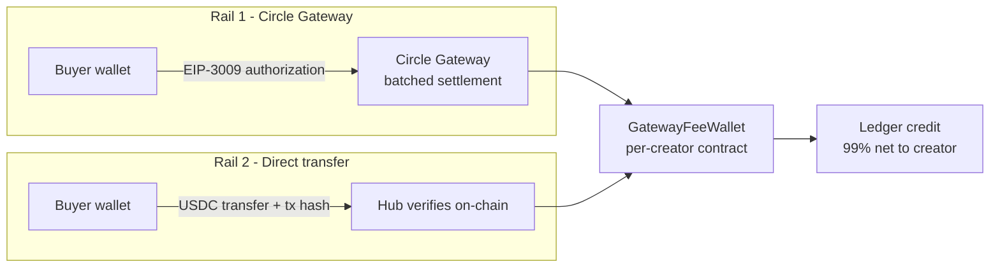
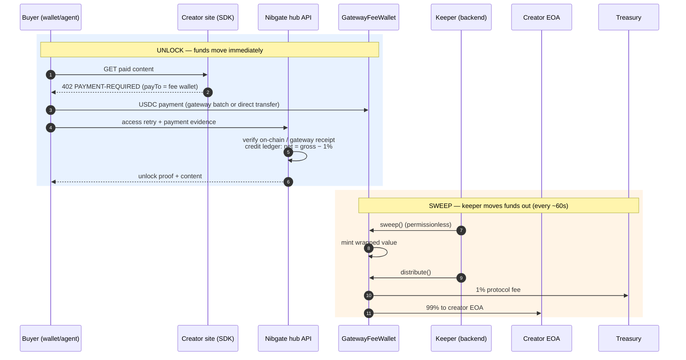

import { Callout, Cards, Steps } from 'nextra/components'

# Revenue model

How a payment becomes spendable creator funds on Nibgate: per-creator **fee wallet contracts**, an on-chain **1% protocol fee**, and a **keeper** that sweeps settled balances to creator wallets. The same model covers both payment rails.

<Callout type="important">
Nibgate never custodies creator funds and cannot move them. Payments land in a contract owned by nobody — the split is enforced by immutable bytecode, not by policy.
</Callout>

## The fee wallet

Every creator gets one **`GatewayFeeWallet`** contract, deployed deterministically (CREATE2) by the **`GatewayFeeWalletFactory`** from the creator's address. The wallet is the payment destination (`payTo`) for all of that creator's paid content:

```txt
creator EOA 0x9c37...  ──deploy──▶  GatewayFeeWallet 0xd03e...
                                    ├─ receives 100% of payments
                                    ├─ keeps 99% for the creator
                                    └─ routes 1% to the treasury
```

Key properties (all enforced on-chain, see `contracts/GatewayFeeWallet.sol`):

- **Immutable** — no proxy, no admin, no upgrade path. Only `feeBps` is mutable, only by the `feeSetter`, and capped at `maxFeeBps` which is frozen at deploy.
- **Split at distribution** — `distribute()` sends `(100% − feeBps)` to the creator EOA and `feeBps` to the treasury in one atomic call. Rounding dust favors the creator.
- **Permissionless operations** — anyone can call `sweep()`/`distribute()`; liveness does not depend on Nibgate running.
- **ERC-1271 restricted** — the wallet's `isValidSignature` only authorizes transfers *from itself*. It can never be tricked into signing arbitrary transfers from other addresses, so it is safe to use as an x402 `payTo` signer context.
- **Factory-guaranteed address** — `deployIfNeeded(creator)` is idempotent and permissionless; the hub can predict the wallet address off-chain without a transaction.

Defaults: `feeBps = 100` (1%), `maxFeeBps = 500` (5%). Configurable via env, never above the deployed cap.

## Both rails pay the fee wallet

The two rails differ only in how the buyer's USDC moves. They converge on the same destination:



- **Gateway rail** — buyer signs an EIP-3009 authorization; Circle batches settlements. The challenge's `payTo` is the fee wallet.
- **Direct rail** — buyer broadcasts a plain USDC `transfer` to the fee wallet; the server verifies the mined `Transfer` log before minting the unlock proof.

In both cases the receipt records `payTo` (the fee wallet), the gross amount, and `protocolFee` (the 1% share) so analytics match on-chain reality exactly.

## Payment → payout lifecycle



<Steps>
### Unlock
The site's SDK returns a 402 with the creator's fee wallet as `payTo`. The buyer pays; funds sit in the fee wallet contract and the hub credits the creator's ledger with the net amount (gross minus the protocol fee).

### Discovery
The keeper periodically lists creators whose wallets hold unsettled balance (from the ledger, not chain scans).

### Sweep + distribute
For each creator the keeper calls `sweep()` then `distribute()` on-chain. The contract splits atomically: creator EOA gets 99%, treasury gets 1%. Failures are isolated per creator and retried next cycle.
</Steps>

## Configuration

| Env var | Default | Meaning |
| --- | --- | --- |
| `NIBGATE_HOSTED_PAY` | `false` | Route challenges through the hub's hosted-pay resolver (fee wallet as `payTo`). |
| `NIBGATE_FEE_WALLET_FACTORY` | — | Deployed `GatewayFeeWalletFactory` address. Required for hosted pay. |
| `NIBGATE_TREASURY` | `0x558e…D12` | Protocol fee recipient used when predicting/deploying wallets. |
| `NIBGATE_FEE_BPS` | `100` | Protocol fee in basis points announced in challenges (capped by the contract). |
| `NIBGATE_MAX_FEE_BPS` | `500` | Upper bound announced at deploy; the contract enforces this forever. |
| `NIBGATE_FEE_KEEPER` | unset | Private key enabling the background keeper sweep loop. |
| `NIBGATE_FEE_KEEPER_INTERVAL_MS` | `60000` | Sweep cadence. |

## Trust model

- **Creator trust** — funds are withdrawable by the creator alone via `distribute()`; even if Nibgate disappears, anyone can trigger the split.
- **Protocol trust** — the 1% fee is enforced by immutable bytecode with a hard 5% ceiling set at deploy; it cannot be raised retroactively.
- **Operator trust** — the keeper key holds no user funds and has no special contract rights; sweep/distribute are permissionless.

## Where to look

- Contracts: `contracts/GatewayFeeWallet.sol`, `contracts/GatewayFeeWalletFactory.sol` (44 Foundry tests).
- SDK integration: `packages/nibgate/src/server/fee-wallet.js`.
- Keeper: `backend/src/server/revenue/keeper.js`.
- Receipts & proofs: [Payments and receipts](/payments-receipts). Leaderboards: [Revenue & leaderboards](/revenue).
