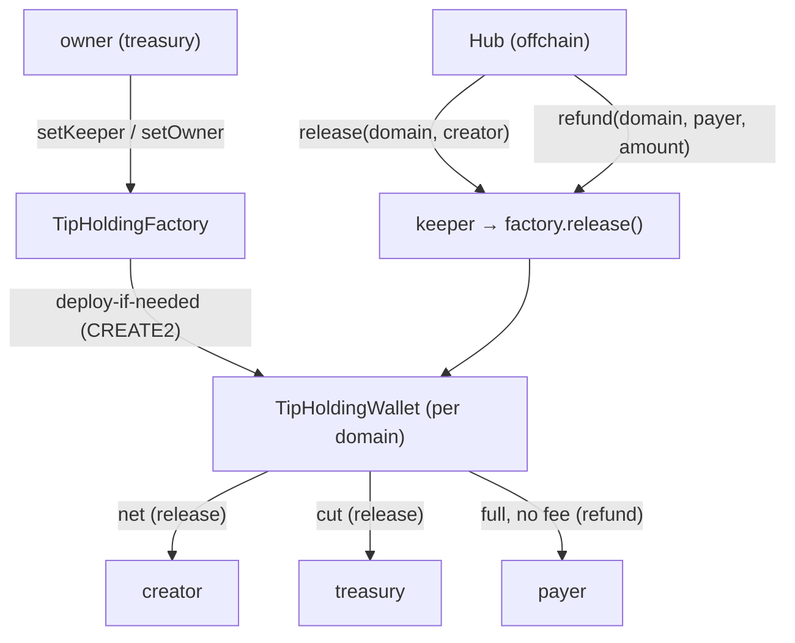

import { Callout } from 'nextra/components'

# Holding contracts

The no-key per-domain boxes behind held tips. One factory per network deploys identical wallet contracts at deterministic addresses; a keeper hot key relays hub-verified claims and refunds.

## Architecture



Nothing holds a key to a box. The wallets have no owner-only withdrawal: the only exits are `release` (creator + treasury split) and `refund` (payer in full), and both are callable solely by the factory during a factory-level call.

## Roles

| Role | Testnet | Mainnet | Powers |
|---|---|---|---|
| Owner | `0x796a…CD68` | treasury `0x558e…9D12` | `setKeeper`, `setOwner` |
| Keeper | hub key (`0x796a…`) | hub hot key (`0x0Ac8…`) | `release`, `refund` on the factory |
| Anyone | — | — | `deploy`, `predict`, `walletFor` (permissionless reads/deploys) |

The owner stays authoritative but cannot extract funds — there is no owner-withdraw function. The keeper only acts on hub-verified requests.

## Addresses

| | Testnet | Mainnet |
|---|---|---|
| Factory | `0xf127a645d7c02a12e0a93b135f8acf9c3332e518` | `0x3b25846c3332fcb8140e2ab60aad2b7fb401fe87` |

Both factories pin the same immutables: USDC `0x3600…0000`, held-tier `feeBps` 500, Gateway domain 26, plus the per-network Gateway wallet/minter.

## Address derivation

`domainHash(domain) = keccak256(bytes(domain))`. A domain's box is:

```txt
CREATE2(
  deployer = factory address,
  salt     = domainHash,
  initCode = TipHoldingWallet creation code ++ abi.encode(
               factory, usdc, treasury, feeBps, gatewayWallet, gatewayMinter, domain)
)
```

`predict()` computes this; `walletFor()` returns the address only if code is already deployed there, else `address(0)`; `deploy()` deploys with the domain hash as salt (idempotent — returns the existing wallet if present). The SDK predicts the identical address offchain from the factory address plus the wallet init-code hash, so payers can fund a box before any code exists there.

## Functions

### `TipHoldingFactory`

| Function | Access | Behavior |
|---|---|---|
| `predict(bytes32)` | view | The CREATE2 box address for a domain hash |
| `walletFor(bytes32)` | view | The address, or `0x0` when undeployed |
| `deploy(bytes32)` | anyone | Materialize the box; emits `HoldingDeployed` |
| `release(bytes32, creator)` | owner-or-keeper | Deploy-if-needed, forward to the wallet, emit `HoldingReleased` |
| `refund(bytes32, payer, amount)` | owner-or-keeper | Deploy-if-needed, forward to the wallet, emit `HoldingRefunded` |
| `setKeeper(address)` | owner | Rotate the automation key |
| `setOwner(address)` | owner | Rotate ownership (e.g. to treasury) |

### `TipHoldingWallet`

Constructor stores immutables: `factory`, `usdc`, `treasury`, `feeBps`, `gatewayWallet`, `gatewayMinter`, `domain` (`feeBps` capped at 5000).

| Function | Access | Behavior |
|---|---|---|
| `release(bytes32, creator)` | factory-only, nonReentrant | `fee = balance × feeBps / 10000`; `payout = balance − fee` → creator; `fee` → treasury if nonzero; revert `empty` on zero balance; emit `Released` |
| `refund(bytes32, payer, amount)` | factory-only, nonReentrant | `value = min(amount, balance)`; transfer to payer in full, no fee; revert `empty` on zero; emit `Refunded` |
| `isValidSignature(bytes32, bytes)` | anyone | ERC-1271 self-authorization for Gateway self-withdrawals (self-transfer intents only) |

Key reverts: `factory-only` (direct calls to a wallet), `owner-or-keeper` (stranger release/refund), `empty` (zero box balance), `creator`/`payer` (zero address), `reentrant`.

## Gas notes

A first touch of a domain deploys the box: ~979k gas (~$0.02 at 20 gwei). Later operations on the same box are ~65k gas (~$0.001). USDC transfers run ~49k gas (~$0.001). **Keep the keeper funded** — claims and refunds fail without relayer gas.

## Security properties

- **No custody:** funds rest in boxes no key controls; the hub only ever records rows and relays hub-verified calls.
- **Payer-only refunds:** the contract sends to the `payer` argument the hub computed from its `held` rows; a valid signature can never redirect funds to a third party.
- **Atomic splits:** `release` pays creator and treasury in one transaction — no half-paid state.
- **No double-spend:** a released box is empty (`refund` reverts `empty` afterwards); a refunded hold leaves its rows `refunded`, excluded from future claim sweeps.
- **Single-wallet binding:** the hub records one verified wallet per domain; a later different wallet returns `409`, never auto-release.

See [Nib Tips](/tipping) for the product flows and the [agent flow](/tipping/agent-flow) for exact request shapes.
