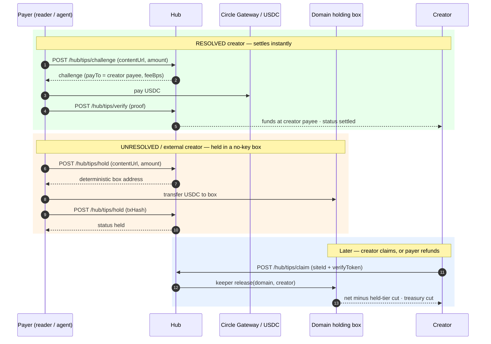

import { Callout, Cards } from 'nextra/components'

# Nib Tips

<Callout type="info">
Examples use Arc testnet values (free faucet USDC). For production, swap in the mainnet column — see [Networks](/networks).
</Callout>

A **Nib Tip** sends USDC from a reader (or agent) to the creator of a page. Tips are **additive revenue** — there is no locked content and no entitlement. The payment receipt *is* the product.

Tipping is the second money rail in Nibgate, alongside [paid unlocks](/payments-receipts). Unlike an unlock, a tip never grants access; it just pays the creator.

## Two paths — settled or held

Whether a tip lands instantly or is held depends on one thing: **can we resolve the creator's wallet?**

| | Creator already on Nibgate (**resolved**) | Creator unresolved (**external page**) |
|---|---|---|
| Endpoint | `POST /hub/tips/challenge` → pay → `POST /hub/tips/verify` | `POST /hub/tips/hold` → fund box → `POST /hub/tips/hold` |
| Result | `settled` — USDC goes straight to the creator's payee | `held` — USDC sits in the domain's no-key box |
| Refundable? | **No** — already paid out | **Yes** — by the payer, until claimed |
| Example | A subblog post, a verified creator site | Any random external URL |

<Callout type="important">
Refunds only ever apply to **held** tips. A resolved creator is paid instantly (`settled`) and a claimed tip is already released — neither can be refunded. Holding exists purely for creators who aren't on Nibgate yet.
</Callout>

## Where each path fires

The UI and SDKs route by one rule: **if the hub can resolve a recipient wallet for the URL, the tip settles; otherwise it holds.** The `/hub/tips/hold` endpoint never tries to resolve — whoever calls it has already chosen the hold path.

- **Subblog post / verified creator site.** `GET /hub/resolve?url=` returns the owner wallet from the hub index (per-article `recipientWallet` wins, otherwise the verified domain owner's wallet). The payee is the creator's fee wallet when the site runs hosted pay, otherwise the creator wallet itself. Challenge → pay → verify → `settled` in full. **Never touches the holding factory. Not refundable.**
- **Nibshare (`/ns/<slug>`).** There is no domain-level creator record for an individual share, so the client passes the share's owner wallet as the explicit `recipient` and follows challenge → verify → `settled`. **Never held, never refundable.** (A hold created *against a nibshare URL* would key to the platform host domain, where no creator site exists to claim it — don't do this; the payer's only recourse would be a refund.)
- **External URL with no resolution.** No hub-index wallet, no page wallet → `POST /hub/tips/hold`. The hub keys the box to the content's hostname (or an explicit `domain`), the payer funds it, and the row lands `held`. Refundable by that payer until the domain owner claims.

<Callout type="warning">
The hold path keys money to a **domain**, not a page. Only hold tips for domains a real creator site can later verify and claim. Holding for a made-up or platform-owned domain strands the funds except via payer refund.
</Callout>



## Endpoints

Canonical bare routes on the hub host — mainnet `https://api.nibgate.xyz`, testnet `https://testnet-api.nibgate.xyz` (see [Networks](/networks)).

| Method | Route | Who | Purpose |
|---|---|---|---|
| `POST` | `/hub/tips/challenge` | payer | Tip challenge for a resolved creator (x402 envelope, `payTo`) |
| `POST` | `/hub/tips/verify` | payer | Record a settled tip after paying the challenge |
| `POST` | `/hub/tips/hold` | payer | Challenge (returns `box`) then record a held tip (with `txHash`) |
| `GET` | `/hub/tips/held?domain=` | anyone | Public list of tips waiting in a domain's box |
| `POST` | `/hub/tips/claim` | creator | Release a domain's box to the verified owner |
| `POST` | `/hub/tips/refund` | payer | Refund unclaimed held tips to the payer |

### `POST /hub/tips/hold`

Called **twice**. Without a proof it returns the box; with a `txHash` it records the held tip.

```bash
# 1. Get the box for the domain
curl -s https://testnet-api.nibgate.xyz/hub/tips/hold \
  -H 'content-type: application/json' \
  -d '{"contentUrl":"https://ext.example/post","amount":"0.05","domain":"ext.example","paymentRail":"transfer"}'
# → { "success": true, "holdStatus": "challenge", "box": "0x…", … }

# 2. Transfer USDC to `box`, then record it
curl -s https://testnet-api.nibgate.xyz/hub/tips/hold \
  -H 'content-type: application/json' \
  -d '{"contentUrl":"https://ext.example/post","amount":"0.05","domain":"ext.example","paymentRail":"transfer","txHash":"0x…","walletAddress":"0xyou"}'
# → { "success": true, "holdStatus": "held", "tip": { … } }
```

### `POST /hub/tips/refund`

The payer proves wallet control with an **EIP-191 `personal_sign`** signature. The hub recovers the signer, sums that payer's still-held tips for the domain, relays an on-chain refund, flips those rows to `refunded`, and writes a negative ledger row so tip totals net out.

```bash
curl -s https://testnet-api.nibgate.xyz/hub/tips/refund \
  -H 'content-type: application/json' \
  -d '{"domain":"ext.example","payer":"0xYou","message":"Nibgate tip refund…","signature":"0x…"}'
# → { "success": true, "amount": 0.05, "refundTx": "0x…" }
```

<Callout type="warning">
The signature is a **wallet-control proof**, not an authorization to move funds anywhere else — a refund can *only* ever return USDC to the signing payer. There is no fee on a refund.
</Callout>

## The on-chain holding box

Held funds live in a **deterministic, no-key contract address** derived per domain (CREATE2 from `keccak256(domain)`). Nobody — not Nibgate, not any keeper key — can move funds out except through `release` (to the verified owner) or `refund` (back to the payer). The hub never custodies the money. Full internals live on the [holding contracts](/tipping/contracts) page.

| | Testnet | Mainnet |
|---|---|---|
| `TipHoldingFactory` | `0xf127a645d7c02a12e0a93b135f8acf9c3332e518` | `0x3b25846c3332fcb8140e2ab60aad2b7fb401fe87` |
| Owner | `0x796a…CD68` (team key) | treasury `0x558e…9D12` |
| Keeper | hub key (`0x796a…`) | hub hot key (`0x0Ac8…`) |
| Held-tier fee (`feeBps`) | 500 (5%) | 500 (5%) |
| Gateway domain | 26 | 26 |

- The box address is predicted offchain with the same inputs (factory address + wallet init-code hash) the factory's `predict()` uses, so payers can safely fund a box that has no code yet — the factory materializes the same address on first use.
- Each domain's box is deployed on first use (claim or refund). A brand-new box costs the relayer ~$0.02 of gas to deploy; subsequent operations on the same domain are ~$0.001. **The mainnet keeper must stay funded** or claims and refunds start failing.
- Holds paid over the Circle Gateway rail land as Gateway ledger credit for the box first; the hub collects it on-chain (the box's ERC-1271 self-withdrawal) before releasing or refunding. If the credit is still settling, claim/refund return `202 pending-settlement` — retry shortly.

## Fees

| Tip | Fee | Why |
|---|---|---|
| Resolved, self-hosted member | 100 bps (1%) | Processing only |
| Held → claimed (non-member) | 500 bps (5%) | Resolution + custody + claim ops |
| Payer refund (unclaimed) | **0** | Funds never reached a creator |

On a settled tip the payer's transfer moves **gross** to the payee at payment time; `protocolFee` is analytic bookkeeping that mirrors the hosted fee wallet's on-chain 99/1 split (hosted fee wallets divide later via `distribute()`; self-hosted creators simply keep the gross). On a claim, the box itself splits: `fee = balance × feeBps / 10000` to the treasury, the rest to the creator, and each released row is stamped with that fee.

See [Revenue model](/revenue-model) and [Payments and receipts](/payments-receipts) for how tips appear in analytics and the public ledger.

## Creator: claiming held tips

When a creator verifies a site they can sweep every tip waiting in its box in one atomic transaction:

```bash
curl -s https://testnet-api.nibgate.xyz/hub/tips/claim \
  -H 'content-type: application/json' \
  -d '{"siteId":"<siteId>","token":"<verifyToken>"}'
# → { "success": true, "releaseTx": "0x…", "feeBps": 500, "protocolFee": … }
```

- Ownership is proven with the site's `verifyToken` (same token as [site verification](/verify-site)).
- The claim sweeps every `held` row matching the domain — rows keyed to the canonical domain *or* carrying a `contentUrl` on the site's domain — then the keeper releases net to the creator and the held-tier cut to the treasury.
- Claiming to a wallet **other than the site's owner wallet** additionally requires a signed `claimToken` proving control of that wallet.
- One verified wallet is bound per domain; a different wallet later goes to manual review, never auto-release (`409 domain-claimed-by-other-wallet`).
- An empty claim returns `{ released: [], pending: 0 }`. A Gateway credit that hasn't settled returns `202 pending-settlement`; a failed collection or on-chain revert returns `502` — nothing is marked released unless the chain call succeeds.

## Payer: refunding held tips

If the creator never claims, the payer can take their money back:

```bash
# See what is waiting
curl -s 'https://testnet-api.nibgate.xyz/hub/tips/held?domain=ext.example'

# Request a refund (sign the message with the paying wallet)
curl -s https://testnet-api.nibgate.xyz/hub/tips/refund \
  -H 'content-type: application/json' \
  -d '{"domain":"ext.example","payer":"0xYou","message":"…","signature":"0x…"}'
```

The refund is always **full amount, no fee**, and only touches tips still in `held` state. An optional `amount` caps the refund at that much (never above your held total); omit it to sweep everything. A Gateway credit that hasn't settled returns `202 pending-settlement`; no held rows for that payer/domain returns `404`.

## SDK

Browser (`@nibgate/sdk/browser`) — fails over to a hold automatically when no creator resolves:

```ts
import { tipContent, holdTipContent, refundTip } from '@nibgate/sdk/browser'

await tipContent({ contentUrl, title, amount: '0.5', signer, hubApi })   // resolved → settled; else → held
await holdTipContent({ contentUrl, amount: '0.5', signer, hubApi })       // explicit hold
await refundTip({ domain, signer, hubApi })                               // payer refund
```

Server (`@nibgate/sdk/server`) — build and relay the on-chain calls yourself:

```ts
import { holdingDeployment, buildHoldingRefund, submitHoldingRefund, buildHoldingRelease } from '@nibgate/sdk/server'

const dep = holdingDeployment('mainnet') // or 'testnet'
const refund = buildHoldingRefund({ domain, payer, amountUsdc, factoryAddress: dep.factoryAddress })
await submitHoldingRefund(refund, { privateKey, rpcUrl, chainId: dep.chainId })
```

React (`@nibgate/wallet`): `useNibgateTip()` returns `{ tip, refund, status, receipt }`; `NibgateTipCard` / `NibgateTipInline` render the UI. The wallet extension detects whether the page's creator is resolved and either settles or holds, and exposes a **Refund** action on held receipts in its activity detail.

## Ledger and analytics

Tips are first-class ledger rows (`type: "tip"`). Refunds write a negative `refunded` row so totals net out. Filter with `GET /hub/ledger?type=tips`. Because funds flow at the payment layer, machine payers are recorded exactly like browser users.

## Coverage record: deployed · tested · documented

### Deployed

- Testnet `TipHoldingFactory` `0xf127a645d7c02a12e0a93b135f8acf9c3332e518` (owner `0x796a…`, keeper hub key) on Arc testnet.
- Mainnet `TipHoldingFactory` `0x3b25846c3332fcb8140e2ab60aad2b7fb401fe87` (owner treasury `0x558e…`, keeper hub hot key) on Arc mainnet.
- Hub `POST /hub/tips/challenge`, `/hub/tips/verify`, `/hub/tips/hold`, `GET /hub/tips/held`, `POST /hub/tips/claim`, `POST /hub/tips/refund` live on both hubs.
- `@nibgate/sdk@0.4.28` published with `tipContent`/`holdTipContent`/`refundTip` (browser) and holding/refund calldata builders (server). The extension holds on unresolved pages and refunds from activity detail; `useNibgateTip()` does both in React.

### Tested

- Forge: 14/14 (release/refund happy paths, keeper paths, non-owner reverts, empty-box reverts, owner rotation).
- SDK vitest: 115/115, including a hermetic Gateway-facilitator stub and browser hold/refund helper tests.
- Extension `tsc --noEmit` clean; extension build clean.
- Live end-to-end on both networks: hold → fund → refund (box emptied, rows `refunded`, negative ledger row), direct challenge → verify (`settled`), nibshare tip (`settled`), subblog hold → claim (`released`, box emptied).

### Documented

- This page (flows, fees, claiming, refunds, SDK, ledger), the [agent flow](/tipping/agent-flow) page, and the [holding contracts](/tipping/contracts) page on the docs site.
- Agent surfaces kept in sync per the repo registry: `openapi.js` (Tips tag, v0.2.6), `discovery.md`, `skill.md`, `llms.txt` / `llms-full.txt`, the agent-skills index, and the MCP server (v0.2.6).

## Trust model

- **Non-custodial:** held funds sit at a deterministic address, movable only by on-chain `release`/`refund`.
- **Keeper relays, never redirects:** the keeper can only trigger `release(domain, creator)` (fee split) or `refund(domain, payer)` (full, payer-only).
- **Owner is authoritative:** the factory owner can rotate the keeper but not extract funds.
- **Refund safety:** a refund proof can only return funds to the signer; there is no path to a third party.

See [Architecture](/architecture) for how the hub, keeper, and contracts fit together.
