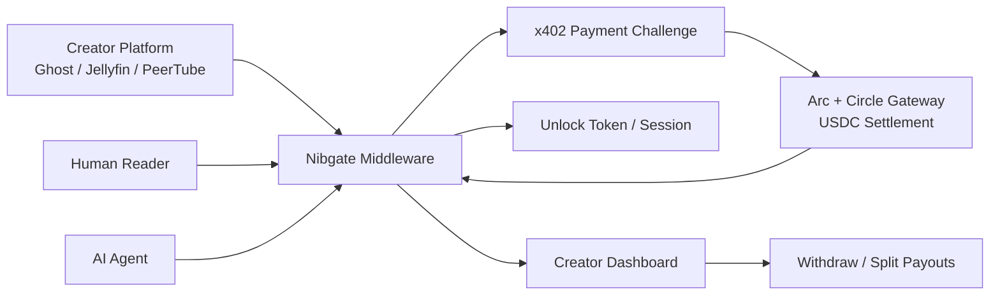

# Nibgate

Dead-simple nanopaywall middleware for popular self-hosted creator platforms.

## Core Thesis

Nibgate lets creators monetize individual pieces of content with tiny USDC payments instead of forcing audiences into subscriptions. It uses Arc, Circle Gateway, and x402 to make payments small enough, fast enough, and agent-readable enough for real daily use.

The wedge is not a generic payment demo. The wedge is a practical plugin or middleware layer for tools creators already run: Ghost, Jellyfin, PeerTube, Owncast, Navidrome, Immich, Mastodon, and similar self-hosted platforms.

The first product should be local-first and self-hosted. A developer should be able to install Nibgate in a project, add a config file, run the Nibgate gateway/app, and put it in front of any website, CMS, media server, or API. Hosted SaaS can come later, but the first trust-building move is infrastructure that creators and developers control.

The user promise:

- Creators earn per real consumption.
- Consumers pay only for what they value.
- Agents can discover, budget, and pay for content automatically.

## Why This Can Get Real Usage

Existing creator platforms usually push creators into subscriptions, memberships, donations, ads, or platform marketplaces. Those models work for some creators, but they are awkward for one-off articles, indie music, livestream minutes, archival photos, research citations, and AI-agent data access.

Nibgate creates a lower-friction option:

- A reader can pay $0.005 for one article without making an account.
- A listener can stream a self-hosted track and pay the artist directly.
- A viewer can approve $0.002 per minute for a livestream.
- A research agent can pay $0.001 for a source page used as grounding context.

Arc matters because the payment amounts are tiny. Traditional rails make sub-cent or cent-level transactions unrealistic once fees, latency, and UX are included. Circle Gateway helps with gas-free, batched USDC movement. x402 gives a web-native payment handshake that humans, apps, and agents can all understand.

## Target Users

### Primary Creators

Self-hosted creators who already control their distribution:

- Independent writers running Ghost.
- Musicians and labels running Navidrome or Funkwhale-like stacks.
- Video creators running PeerTube, Jellyfin, or Owncast.
- Photographers and communities running Immich.
- Researchers, curators, newsletter writers, and dataset owners.

### Primary Consumers

People who do not want another subscription:

- Readers who only want one article.
- Fans who want to directly support one track, video, or stream.
- Power users who already have wallets or passkeys.
- Communities that prefer direct creator payments over platform fees.

### Agent Users

Autonomous agents that need paid access to content or data:

- Research agents paying for grounding citations.
- Scrapers paying origin sites instead of bypassing value capture.
- Personal assistants buying one-off media, reports, or API responses.
- Creator agents pricing and publishing paid resources automatically.

## MVP Scope

The hackathon MVP should prove one tight loop extremely well:

1. A creator protects a piece of content.
2. A human pays a tiny USDC amount to unlock it.
3. An agent discovers the price and pays automatically.
4. The creator sees earnings update.

Recommended first platform: Ghost.

Ghost is likely the fastest first integration because content pages are simple, creators understand paid writing, and a demo is easy to judge in two minutes.

### MVP Features

- x402 paywall for a Ghost article.
- Arc testnet payment settlement through Circle Gateway.
- Wallet or passkey-based payment UX.
- Agent-readable payment metadata.
- Basic unlock session/token after payment.
- Creator dashboard with earnings by post.
- Revenue split metadata with one author and optional contributors.
- Demo agent script that pays for one article and returns a citation.

### Non-MVP

These are compelling but should not block the first demo:

- Full per-second audio/video metering.
- Multi-platform plugin support.
- Quadratic funding pools.
- Complex royalty trees.
- Fraud detection.
- Fiat card onboarding.
- Creator tax/reporting tooling.

## First Product Shape

Nibgate can be built as a gateway/middleware service before becoming a deep native plugin for every platform.

### Remotion-Style Product Model

Nibgate should feel like a developer framework and local tool first:

- `npx nibgate init` creates a project config.
- `npx nibgate dev` runs the local gateway and Nibgate app.
- `npx nibgate routes` shows protected routes and prices.
- Docker Compose runs Nibgate beside an existing self-hosted app.
- Native plugins wrap the same core gateway instead of reimplementing payment logic.

The analogy is Remotion: Remotion gives developers a programmable local video workflow that can later render on servers or cloud infrastructure. Nibgate should give developers a programmable local payment-access workflow that can later run as hosted infrastructure.

The local panel is essential. Creators should not need to read JSON to understand what is happening. They should see protected routes, prices, unlocks, agent purchases, revenue splits, and withdrawal state in a browser UI running on their own machine or VPS.

### Mode 1: Reverse Proxy Paywall

A creator puts Nibgate in front of specific routes:

- `/paid/*`
- `/members-only/*`
- `/premium/articles/*`
- `/audio/*`

Nibgate checks whether the request has a valid unlock proof. If not, it returns an x402 payment required response with price metadata. After payment, it grants access.

This is the most reusable route across Ghost, static sites, media servers, and APIs.

### Mode 2: Ghost Theme/Plugin Snippet

For Ghost, add a small script or theme helper that:

- Marks paid posts with price metadata.
- Shows an unlock button.
- Calls Nibgate to create payment intent.
- Replaces the teaser with full content after unlock.

### Mode 3: Agent API

Agents call:

- `GET /.well-known/nibgate.json`
- `GET /content/:id/price`
- `POST /content/:id/pay`
- `GET /content/:id/access`

The API should expose price, content type, license terms, refund policy if any, creator identity, accepted networks, and maximum recommended payment.

## Architecture

## Payment Model

### One-Time Unlock

Best for:

- Articles.
- Photo albums.
- Reports.
- Dataset files.
- API responses.

Example pricing:

- $0.001 for agent citation access.
- $0.005 for a short post.
- $0.03 for a premium article.
- $0.10 for a report or dataset sample.

### Metered Streaming

Best for:

- Audio.
- Video.
- Livestreams.
- Long podcast episodes.

Example pricing:

- $0.0005 per song play.
- $0.001 per minute of audio.
- $0.002 per minute of livestream.
- $0.005 per minute of premium video.

For the hackathon, simulate this with a timer and periodic payment authorization. Build the real metering after the Ghost article flow works.

### Royalty Splits

Start simple:

- One primary creator wallet.
- Optional split recipients with percentages.
- Platform fee between 5% and 8%.

Later:

- Track-level credits.
- Album-level splits.
- Organization wallets.
- Community funding pools.
- Escrowed payouts.

## Real User Flows

### Reader Flow

1. Reader lands on a Ghost article.
2. Page shows preview and price: "Unlock for $0.005".
3. Reader pays with wallet or passkey.
4. Article unlocks instantly.
5. Creator dashboard updates.

### Agent Flow

1. Research agent discovers a paid article through RSS or search.
2. Agent reads Nibgate metadata.
3. Agent checks user budget and content license.
4. Agent pays $0.001 for citation access.
5. Agent uses the article as a source and records proof of payment.

### Creator Flow

1. Creator installs Nibgate.
2. Creator connects wallet.
3. Creator chooses protected routes or posts.
4. Creator sets price.
5. Creator shares content normally.
6. Creator watches earnings and unlock events in dashboard.

### Streamer Flow

1. Viewer opens a livestream.
2. Viewer approves $0.002 per minute.
3. Nibgate meters active watch time.
4. Stream pauses if authorization expires or budget is reached.
5. Creator sees balance tick up in real time.

## Hackathon Build Plan

### Day 1: Foundation

- Fork or study `circlefin/arc-nanopayments`.
- Decide on stack: Next.js app, small Node/Express middleware, Ghost demo site.
- Implement x402 payment-required response for a protected article endpoint.
- Hardcode one creator wallet and one article.

### Day 2: Human Unlock

- Build article preview page.
- Add "Unlock for $0.005" payment flow.
- Store unlock session after successful payment.
- Show full article after payment.

### Day 3: Agent Mode

- Add `.well-known/nibgate.json`.
- Add price discovery endpoint.
- Add CLI or script agent that checks a budget and pays.
- Return article text plus citation/payment metadata.

### Day 4: Creator Dashboard

- Show total earnings.
- Show unlock count by article.
- Show human vs agent unlocks.
- Show pending splits and platform fee.

### Day 5: Polish and Demo

- Deploy demo.
- Record a two-minute video.
- Prepare judge pitch.
- Onboard 2-5 real creator testers if possible.

## Demo Script

1. Open a Ghost-style blog post.
2. Show the preview and $0.005 unlock price.
3. Pay and unlock instantly.
4. Open dashboard and show earnings update.
5. Run agent script from terminal.
6. Agent discovers article price, pays $0.001, and returns a citation.
7. Dashboard updates again with "agent unlock".

## Judge Pitch

Nibgate turns self-hosted creator platforms into agent-readable, pay-per-use businesses. Instead of forcing creators into subscriptions or ads, it lets them sell one article, one song, one image, one API response, or one minute of video for tiny USDC payments. Arc makes the economics work; Circle Gateway makes the payment UX practical; x402 makes the access pattern native to the web and usable by agents.

The beachhead is Ghost because paid writing is easy to understand, but the platform expands to media servers, APIs, datasets, and agent markets.

## Business Model

- 5% to 8% transaction fee on creator volume.
- Premium analytics for creators.
- White-label infrastructure for communities and media networks.
- Agent access APIs for paid content discovery.
- Optional hosted Nibgate for creators who do not want to self-host.

## Go-To-Market

Start where self-hosters already gather:

- Reddit: `r/selfhosted`, `r/Ghost`, `r/jellyfin`, `r/peertube`.
- Discords for Ghost, Jellyfin, PeerTube, Owncast, Navidrome.
- Indie creator communities.
- AI agent builder communities.
- Crypto creator monetization communities.

Hackathon traction target:

- 5 to 10 creators contacted.
- 2 to 3 creators test the demo.
- 1 public self-hosted creator agrees to try it post-hackathon.
- At least one agent demo paying for content.

## Risks

### Wallet Friction

People may not want to connect a wallet for $0.005. Passkeys, custodial balances, or prepaid credits may be needed for mainstream readers.

### Creator Setup Friction

Self-hosters tolerate configuration, but only up to a point. The install path must be copy-paste simple.

### Content Quality

Micropayments do not create demand by themselves. The first creators need real audiences and content people already want.

### Payment Semantics

For agents, price, license, refund, and attribution metadata need to be clear. Otherwise agent purchases are hard to trust.

## Open Questions

- Should the first integration be Ghost-native or reverse proxy first?
- Should users pay directly per item or preload a small balance?
- How should unlock tokens expire?
- What is the best split between Circle Gateway and local app state for the demo?
- Can x402 metadata include enough licensing information for agents?
- How much of per-second streaming can be honestly demoed within the hackathon?

## Best First Build

Build the Ghost article unlock flow first.

The smallest lovable version:

- One paid Ghost-style article.
- One creator wallet.
- One $0.005 human unlock.
- One $0.001 agent unlock.
- One dashboard showing earnings.

That is enough to prove the primitive: content can ask for money, humans and agents can pay, and creators can earn instantly from actual consumption.
